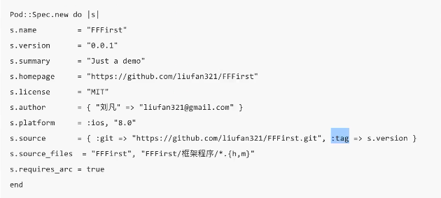

# Cocoapods 发布框架

### 发布框架

- 注册

```
pod trunk register xxx@gmail.com "我的名字"
```

- 查询 pod 注册信息

```
pod trunk me
```

- 生成 spec 文件

```
pod spec create https://github.com/liufan321/FFFirst
```

- 编辑 `podspec` 文件



- 验证  spec 文件

```
pod spec lint

pod spec lint --verbose
```

- 推送

```
pod trunk push
```

