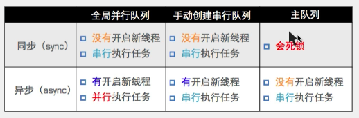

# GCD

- ### 简介

  > C语言
  >
  > 旨在替代NSThread等线程技术
  >
  > 充分利用设备的多核
  >
  > 线程生命周期自动管理

- ### 什么是 GCD

  > 全称是Grand Central Dispatch
  >
  > 纯C语言，提供了非常多强大的函数

- ### GCD 优势

  > GCD是苹果公司为多核的并行运算提出的解决方案
  >
  > GCD会自动利用更多的CPU内核(比如双核、四核)
  >
  > GCD会自动管理线程的生命周期(创建线程、调度任务、销毁线程)
  >
  > 程序员只需告诉GCD想要执行什么任务，不需要编写任何线程管理代码

- ### GCD 两个核心概念

  > 任务 Operation：要执行的耗时操作，比如打开网页、循环等
  >
  > 队列 Queue：用来存放任务

- ### GCD 使用的两个步骤

  - 创建任务：确定要做的事情

  - 将任务添加到队列中，就自动开始执行了

    > GCD会自动将队列中的任务取出，放到对应的线程中执行
    >
    > 任务取出遵循FIFO原则：First in First out.

- ### GCD中执行任务的2个函数

  - 同步方式执行任务

    > dispatch_sync(dispatch_queue_t queue, dispatch_block_t block)
    >
    > 同步，在当前线程中执行任务，不开新线程

  - 异步方式执行任务

    > dispatch_async(dispatch_queue_t queue, dispatch_block_t block)
    >
    > 异步，在新的线程中执行任务，会开新线程(只有开多于1个线程才能异步执行)

- ### GCD队列的2大类型

  - **并发队列**(Concurrent Dispatch Queue)

    - 作用

      > 可以让多个任务并发(同时)执行(自动开启多个线程同时执行任务)
      >
      > 并发功能只有在异步(dispatch_async)函数下才有效

    - 全局队列

      > 本质就是并发队列
      >
      > - 全局队列和并发队列的区别
      >
      >   > 全局队列一直存在，并发队列任务执行完会销毁
      >   >
      >   > 并发队列有名称，可以跟踪错误，全局队列没有
      >   >
      >   > 在ARC中不需要考虑释放内存，因为不允许调用dispatch_release(q).
      >   >
      >   > 在MRC中需要手动释放内存，并发队列是create创建出来的，在MRC中见到create就要release，全局队列不需要release(只有一个)。
      >   >
      >   > 一般使用全局队列
      >
      > - 全局队列的参数
      >
      >   > 第一个: 服务质量(线程的优先级)
      >   >
      >   > 第二个: future use

  - **串行队列**(Serial Dispatch Queue)

    - 作用

      > 让任务一个接一个执行(一个完成后再执行下一个)

    - 主队列

      > 是个**特殊**的串行队列
      >
      > - 在async函数中【异步执行】
      >
      >   > **不开线程**(特殊之处，与一般串行队列不同)，同步执行
      >   >
      >   > 主队列特点: 如果主线程正在执行代码暂时不调度任务，等主线程执行结束后再执行任务
      >   >
      >   > 又叫全局串行队列
      >
      > - 在sync函数中【同步执行】
      >
      >   > 程序执行不出来(<u>`死锁`</u>)
      >   >
      >   > 死锁的原因:
      >   >
      >   > 当程序执行到下面sync函数这段代码的时候
      >   >
      >   > 主队列：如果主线程正在执行代码，就不调度任务
      >   >
      >   > 同步执行：如果第一个任务没有执行，就继续等待第一个任务执行完成，再执行下一个任务此时互相等待，程序就无法往下执行(死锁)
      >
      > - 注意:
      >
      >   > 虽然主队列也是串行队列，但它执行异步任务时不开新线程，即做dipatch_async函数的参数时, 只是等主线程当前正在执行的任务结束后再执行主队列的任务

- ### 队列 和 同异步执行的组合

  - sync函数 + 串行队列

    > 特点: 不开新线程(就在当前线程)，队列中任务一个一个按顺序执行

  - sync函数 + 并行队列

    > 特点: 不开线程(只在当前线程)，队列中任务一个一个按顺序执行(因为只有一个线程，无法异步)

  - async函数 + 串行队列

    > 特点: 新开一个线程，队列中任务一个一个按顺序执行
    >
    > **注意**: **虽然主队列也是串行队列，但它执行异步任务时不开新线程，只是等主线程当前正在执行的任务结束后再执行主队列的任务**

  - async函数 + 并行队列

    > 特点: 新开多个线程，无序执行

  

- ### 使用方法

  > - 选择一个用来存放任务的合适的队列
  >
  > - 使用dispatch_async或dispatch_sync函数将任务block添加到队列并开始执行
  >
  > - GCD会自动将队列中的任务取出，放到对应的线程中执行
  >
  >   任务取出遵循FIFO原则：First in First out.

  ```objc
  // OC
  - (void)touchesBegan:(NSSet<UITouch *> *)touches withEvent:(UIEvent *)event {
  //    // 创建队列
  //    dispatch_queue_t queue = dispatch_get_global_queue(0, 0);
  //    // 创建任务
  //    dispatch_block_t task = ^ {
  //        NSLog(@"%@", [NSThread currentThread]);
  //    };
  //    // 将任务添加到队列
  //    dispatch_async(queue, task);
      
      // 简易用法
      dispatch_async(dispatch_get_global_queue(0, 0), ^{
          NSLog(@"%@", [NSThread currentThread]);
      });
  }
  ```

  ```swift
  // Swift
   // 模拟从网络异步加载视图配置信息 JSON，并存储到 沙盒中
  DispatchQueue.global().async {
      let url = Bundle.main.url(forResource: "main.json", withExtension: nil)
      let data = try! Data(contentsOf: url!)
  
      let docPath = NSSearchPathForDirectoriesInDomains(.documentDirectory, .userDomainMask, true)[0]
      let docUrl = URL(fileURLWithPath: docPath)
      let fileURL = docUrl.appendingPathComponent("main.json")
      print(fileURL.absoluteString)
      try? data.write(to: fileURL)
  }
  ```

  

- ### 理解方式

  当 CPU 开始执行某线程上的代码时:

  - 执行到async函数代码块时，会"直接跳过"函数参数Queue中的任务(代码块)[其实是开了另外的线程去执行Queue中的任务]，直接执行后面的代码。

  - 执行到sync函数代码块时，当前线程会等待函数参数Queue中所有任务(代码块)执行完毕，才继续执行后面的代码

  - 而Queue中的所有任务(代码块)，会根据Queue种类不同有不同的执行方式:

    > serial串行执行: 所有任务一个一个按顺序执行
    >
    > concurrent并发执行: 几个任务同时开始执行，高效率省时间，但是没有顺序

- ### 同时使用同步和异步保证任务执行顺序

  ```objc
  // 模拟app store购买的过程
  // 验证密码 - 扣费 - 下载应用
  
  - (void)touchesBegan:(NSSet<UITouch *> *)touches withEvent:(UIEvent *)event {
      // 因为这三个环节都是通过网络，会是耗时操作，所以不能同步执行，不然会导致卡死
      //
      // 这里是异步，所以肯定会开一个线程执行里面这三个添加任务的代码
      dispatch_async(dispatch_get_global_queue(0,0), ^{
          
          // 这里是同步(不开新线程)，所以在当前线程按顺序执行(不管什么队列)
          dispatch_sync(dispatch_get_global_queue(0, 0), ^{
              NSLog(@"1. 验证密码: %@", [NSThread currentThread]);
          });
          // 这里是同步(不开新线程)，所以在当前线程按顺序执行(不管什么队列)
          dispatch_sync(dispatch_get_global_queue(0, 0), ^{
              NSLog(@"2. 扣费: %@", [NSThread currentThread]);
          });
          // 这里是异步(开新线程执行，也可能会线程重用)，但是只有这一个任务了，前面两个任务都完成了，所以这最后一个任务无所谓按顺序与否
          dispatch_async(dispatch_get_global_queue(0, 0), ^{
              NSLog(@"3. 下载应用: %@", [NSThread currentThread]);
          });
      });
  }
  ```

  

- ### barrier阻塞

  > 主要用于在多个异步操作完成后，统一对非线程安全的对象进行更新
  >
  > 适合于大规模的I/O操作
  >
  > 当访问数据库或文件的时候，更新数据的时候不能和其他更新或读取的操作在同一时间执行，可以使用调度组，不过有点复杂。
  >
  > 可以使用dispatch_barrier_async解决

- ### 延迟执行

  ```objc
  // OC
  NSLog(@"三秒后打印我爱你");
  dispatch_after(dispatch_time(DISPATCH_TIME_NOW, (int64_t)(3 * NSEC_PER_SEC)), dispatch_get_main_queue(), ^{
          NSLog(@"我爱你");
      });
  ```

  ```swift
  // Swift
  // 为了防止还没滚到顶部，就已经开始刷新数据了
  DispatchQueue.main.asyncAfter(deadline: .now() + 1) {
      tvc.loadData()
  
      // 刷新新微博后，取消 tabbar 和 APP 红点
      self.tabBar.items?[0].badgeValue = nil
      UIApplication.shared.applicationIconBadgeNumber = 0
  }
  ```

  

- ### 一次执行

  ```objc
  /*
       原理是在常量区设置了一个变量，执行一次后设个值，以后每次过来检查如果是这个值就不执行
       
       */
      for (int i = 0; i < 1000; i++) {
          static dispatch_once_t onceToken;
          NSLog(@"%ld", onceToken);
          dispatch_once(&onceToken, ^{
              NSLog(@"我只执行一次");
          });
          NSLog(@"%ld", onceToken);
      }
      
  ```

  

- ### 调度组监听所有任务完成通知

  > 要异步(多个线程)下载三首歌，三首歌全部下载完成后通知用户，就可以使用dispatch_group【但并不能保证下载完成的先后顺序】

  ```swift
  // Swift
   /*
       1) loadImage 是 SDWebImage 的核心方法
       2) 图像下载完成后，会自动保存在沙盒中，文件路径是 URL 的 md5
       3) 如果沙盒中已经存在缓存的图像，后续使用 SD 通过 URL 加载图像，都会加载本地沙盒的图像
       4) 不会发起网络请求，同时，回调方法，同样会调用！
       5) 方法还是同样的方法，调用还是同样的调用，不过内部不会再次发起网络请求！
       ***注意*** 如果缓存的图像累计很大，要找后台要接口！
       */
      /// 缓存只有一张图像的微博的图像
      /// - Parameter list: 本次下载的视图模型数组
      private func cacheSingleImage(list:[JLStatusViewModel], finished: @escaping (_ isSuccess:Bool, _ shouldRefresh:Bool)->()) {
          
          // 记录所有单张图片缓存的内存大小
          var cacheSize = 0
          // 创建调度组
          let group = DispatchGroup()
          // 遍历此次获取的微博数组
          list.forEach{(vm) in
              // 找到只有 1 张图片的，进行下载缓存
              if vm.picURLS?.count == 1, let urlStr = vm.picURLS?.first?.thumbnail_pic {
                  // `入组` 将要执行图片下载任务
                  group.enter()
                  
                  // 用 SD 下载此图片并自动缓存
                  SDWebImageManager.shared.loadImage(with: URL(string: urlStr), options: [], context: nil, progress: nil) { (image, data, nil, _, _, _) in
                      cacheSize += data?.count ?? 0
                      // 更新单个图片的尺寸
                      if let image = image {
                          vm.updateSingleImageSize(with: image)
                      }
                      // `出组` 此图片任务完成，
                      group.leave()
                  }
              }
          }
          // 监听调度组任务完成情况
          group.notify(queue: .main) {
              print("此次所有单张图片缓存完毕，大小为: \(cacheSize / 1024)kb")
              // 完成回调
              finished(true, true)
          }
      }
  ```

  