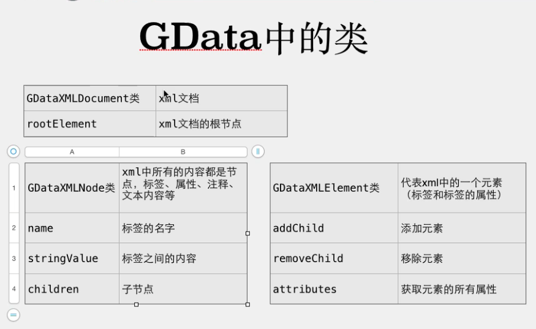

# XML 的 存储 和 解析

> 数据数组和字典与 XML Data互转

- ### SAX的方式解析:

  - 简介

    > SAX: simple API for XML
    >
    > 特点: iOS上解析，速度快，内存占用小，只读

  - SAX的解析步骤:【具体见网络通信的Day02】

    > 1. 加载xml数据【获取网络中的xml data】
    >
    > 2. 创建NSXMLParser对象parser
    >
    > 3. 设置parser的delegate
    >
    > 4. 在NSXMLParserDelegate协议方法中解析XML data
    >
    >    a. 开始解析XML文档【didStartDocument】
    >
    >    b. 找开始节点(包括节点的属性)【didStartElement】
    >
    >    c. 找节点之间的内容【foundCharacters】
    >
    >    d. 找结束节点【didEndElement】
    >
    >    e. 完成XML文档解析【parserDidEndDocument】

  - 注意

    > 使用KVC为对象属性赋值注意:
    >
    > KVC赋值的过程就是将value的地址赋值给key，即对象的属性指针指向value，所以在从网络中获取数据转模型时，模型类的属性最好设置为copy，这样在赋值的时候会复制一份value，把新value的地址赋值给key。在setValue过程中不会做类型转换，直接把value地址赋值给属性指针。这也是为什么NSNumber类型的属性，用string类型的value也可以赋值的原因。

- ### DOM 的方式解析

  - 简介

    > DOM : 
    >
    > Document Object Model 文档对象模型(文档树模型)
    >
    > 把整个xml文件当成文档对象来处理，所有信息都在这个文档对象中。
    >
    > 
    >
    > 特点: 
    >
    > mac上的解析方式，iOS无法直接使用，解析过程中内存占用大，读写
    >
    > 一次性把xml全部加载到内存，内存消耗大
    >
    > 之前的SAX方式只能读取XML，DOM可以修改，添加、删除、修改节点
    >
    > iOS默认不支持DOM解析(不支持NSXML这个类)
    >
    > 在iOS解析DOM需要使用第三方框架
    >
    > GData/KissXML(XMPP中使用此框架)
    >
    > 适合读写比较小的XML文件

  - GData 解析的步骤【详见网络通信Day03，DOM解析】

    > - 将GDataXMLNode.h和m拖进项目
    > - 在build setting中搜索'Header Search Paths'，添加/usr/include/libxml2
    > - 在build setting中搜索'Other Linker Flags'，添加-lxml2
    > - 获取xml data
    > - 使用data创建document(GDataXMLDocument)对象
    > - 获取根元素(节点)document.rootElement
    > - rootElement的所有children就是一个个video对象，遍历并video对象
    > - rootElement每个child是一个video对象，child的children是video的子标签(就是video的属性)，使用KVC赋值
    > - rootElement每个child是一个video对象，child的attributes是video的属性(就是video的属性)，使用KVC赋值

    

    

