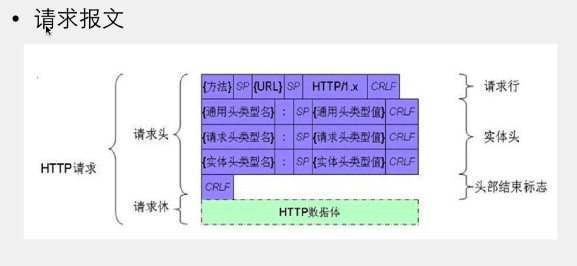
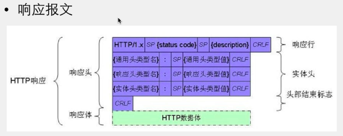

# HTTP协议


### 遵守 HTTP 协议的网络通信

- ### 请求 request

  > 向服务器发送的数据
  >
  > 请求头、请求体

  - HTTP 请求 

    > HTTP Request，即要发送给服务器的数据，遵守HTTP协议固定格式的数据

  - HTTP 请求方法

    - GET

      > GET一般是获取服务器上的数据，可向服务器传递少量数据
      >
      > - 优点
      >
      >   - GET速度相对较快
      >
      >   - GET方式是通过URL传递数据，效率高
      >
      > - 缺点
      >
      >   - 请求的数据在URL上，相对不安全
      >
      >     > login.php?username=zs&pwd=123456
      >
      >   - GET请求的结果能够被浏览器缓存
      >
      > - URL 中的参数

    >  > a. login.php负责处理登录过程的服务器脚本
    >  >
    >  > b. ?后面跟要传到服务器上的参数(http协议的一部分)
    >  >
    >  > c. 参数以 键=值 的形式传递
    >  >
    >  > d. 如果有多个参数使用&连接
    >  >
    >  > http://127.0.0.1/php/login.php?username=admin&password=123
    >  >
    >  > e. 参数中如果有中文和空格创建URL会失败, 需要使用%转义，进行URL编码
    >  >
    >  > ```swift
    >  > // 获取网络服务器上JSON数据
    >  >  NSString *username = @"张三";
    >  >  NSString *password = @"zhan";
    >  >  NSString *urlString = [NSString stringWithFormat:@"http://127.0.0.1/php/login.php?username=%@&password=%@",username, password];
    >  >  // 如果url字符串中有汉字或空格，要对url字符串中?后面的空格或者汉字做百分号转义
    >  >  urlString = [urlString stringByAddingPercentEncodingWithAllowedCharacters:[NSCharacterSet URLQueryAllowedCharacterSet]];
    >  >  NSURL *url = [NSURL URLWithString:urlString];
    >  > ```
    >  >
    >  > 

    - POST

      > POST速度相对GET较慢

    >传递大量数据时使用，比如上传文件使用post
    >
    >POST一般是往服务器提交数据，并获取服务器返回的结果
    >
    >POST方式是通过请求体传输数据，效率低
    >
    >POST请求的数据用户看不到，并且不能被浏览器缓存相对安全，传递隐私数据时使用
    >
    >- POST请求头比GET请求头中多的东西
    >
    >  Content-Length: 25 // 发送给服务器数据的大小
    >
    >  Cache-Control: max-age=0 // 永不缓存数据
    >
    >  Content-Type: application/x-www-form-urlencoded // 请求头中的Content-Type
    >
    >  // 告诉服务器，发给服务器的数据格式和url中传参的格式是一样的 key=value&k1=v1

    - HEAD

      > 不获取响应体，只获取响应头
      >
      > 一般在下载之前先获取文件的大小

    - PUT

      > PUT 上传
      >
      > 配置Apache服务器WebDav功能
      >
      > put直接以文件的方式写入
      >
      > post需要服务器端脚本支持

    - DELETE

    - OPTIONS

    - TRACE

    - CONNECT

    - PATCH

  - 请求体中各项的含义

    > - 请求体:
    >
    >   > ------WebKitFormBoundaryqwY1zO88PZll2khX
    >   >
    >   > Content-Disposition: form-data; name="userfile"; filename="pic03.jpg"
    >   >
    >   > Content-Type: image/jpeg
    >   >
    >   > 
    >   >
    >   > 二进制数据(要上传的文件)
    >   >
    >   > ------WebKitFormBoundaryqwY1zO88PZll2khX--
    >
    > - 含义:
    >
    >   > 分隔符 ------WebKitFormBoundaryqwY1zO88PZll2khX
    >   >
    >   > name 表单的name属性值
    >   >
    >   > filename 传递给服务器的文件名
    >   >
    >   > Content-Type 告诉服务器传递的文件类型
    >   >
    >   > text/plain image/jpeg image/jpg image/png application/octet-stream等
    >   >
    >   > 二进制数据 要上传文件的NSData

- ### 响应 response

  > 即服务器返回的数据

  - HTTP 响应

    > - HTTP Response 即从服务器接收的数据，遵守HTTP协议固定格式的数据
    >
    > - 响应的构成
    >   - 状态行Status Line 
    >   - 响应头Headers
    >   - 响应体Content

  - 状态码

    > 200 正常
    > 401 没有授权






