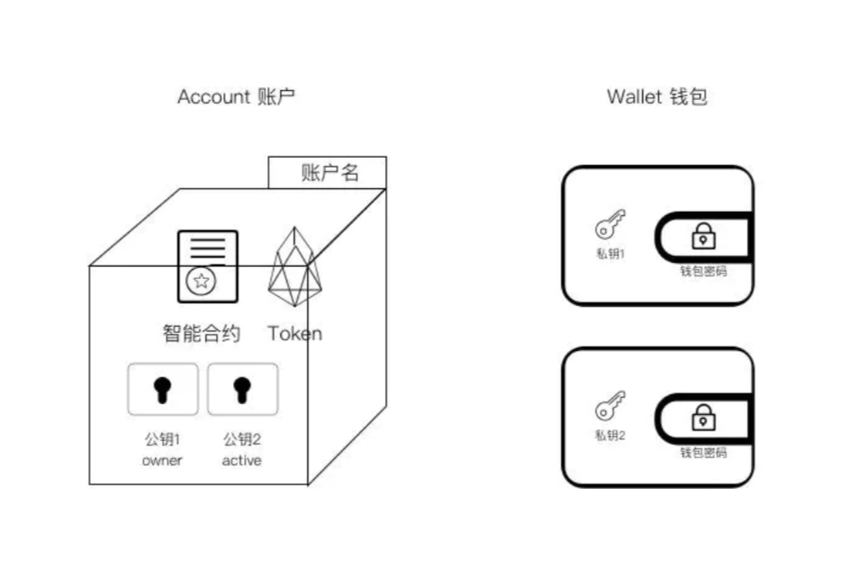

# EOS基本概念

### 发送一笔交易(transaction)的流程

> 用户通过接口创建一个Transaction对象，将它发送给钱包，钱包使用存储在其中的私钥对它进行签名，然后返回带有签名的Tansaction对象，然后这个对象被广播到全网。当网络确认这个Transaction有效，它就会被包含进区块链上的一个区块中。

## 钱包作用

- 生成密钥对

  > 用cleos wallet create_key创建了一组(用来开发的)密钥对，公钥是EOS8mkDUDottP33MaC1wNFfCPQVF2JCdR9usQWTCG53jL264Tmtpp

- 保存秘钥对

  > 钱包是储存公私钥对的仓库。在链上要执行的操作必须使用私钥签名。使用cleos来操作钱包。
  >
  > Wallets are repositories of public-private key pairs. Private keys are needed to sign operations performed on the blockchain. Wallets are accessed using cleos.

- 提供签名服务，用私钥签名交易

## 账户

一个账户是一个授权的集合，存储在区块链上，用来辨别发送者或接收者。它有一个灵活的授权结构使它可以被个人或者群组所拥有，这取决于权限(permission)怎么分配，往区块链上发送或者接受交易(Transaction)需要账户。

像一块有名称(账户名)的内存空间

> - 智能合约: 合约中的方法要被调用的话，是需要不同的权限的
>
> - Token 通证等代币
>
> - 公钥1: owner 用owner公钥对应的私钥打开具有owner权限
>
> - 公钥2: active 用active公钥对应的私钥打开具有active权限

上面这个样子，一个保险柜有两个开关，不过打开后可以进行操作的权限是不同的。2个私钥可以存在一个钱包里，也可以如上图所示存在不同的钱包里（由不同的人控制）。

owner权限是账户的最高权限，可以修改其它权限。
active权限默认可以进行转账等操作，但不能修改权限。

每个保险箱有一个名字，就是EOS账户名。
 转账和智能合约等操作的执行都是在Account这个保险箱进行，所以账户名在EOS世界其实是以太坊的地址。
 与以太坊不同，EOS的账户名不再是一串很长很长的地址，而是一个你可以自定义的英文字母+数字(12345)+符号(.)，最长12位，最短1位，全局唯一，先到先得，注册费用还没公布，但据最新的消息，长度不同注册需要的EOS也不一样。

## 系统用户

每个新EOSIO链有一个默认的system用户叫做eosio，此账户通过加载规定有此EOSIO区块链的管理和共识的system contracts来对此链进行配置，每个新EOSIO区块链都自带一个开发私钥，且这个私钥都是一样的。这个私钥是用来以system user (eosio)的身份签名交易的。用cleos wallet import可以获得这个私钥

**系统用户的私钥**

5KQwrPbwdL6PhXujxW37FSSQZ1JiwsST4cqQzDeyXtP79zkvFD3

## 推送交易RPC

rpc的json文件其实就是确定了以下这几件事，

code: "eosio" 这条消息要发送给哪个账户执行，即要被调用的方法所属的对象

action:"newaccount"  方法名

args: 方法要传入的参数

