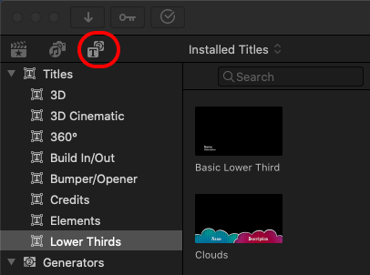
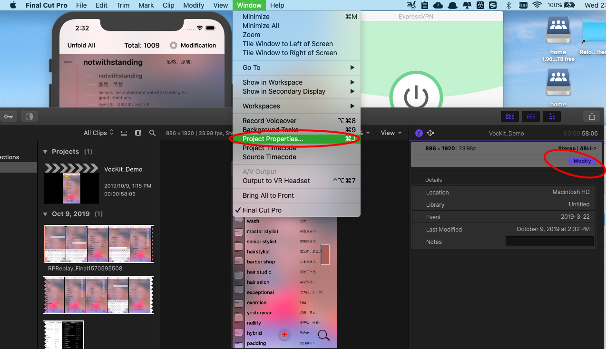

# Final Cut Pro X/ FCPX

Library 库 -> Event 事件 -> Project 项目

Browser 浏览器、Preview 预览、Different Inspector  属性检查器、Timeline 时间轴、Storyline 故事线、Playhead 播放头、Transitions 过渡、Effects 效果

## 将素材导入**事件** Import Media to your Event 

Import: Command I

Set In and Out

Bring footage to the project: 将视频片段导入项目

E: 将选中片段放到故事线的结尾  (send to end)take out from event to the storyline end.

Q: 将选中片段取出放到故事线上，播放头后面，原来视频片段的上面的位置 take out from to the storyline whereafter the playhead and above the clip that was there.

W: 将选中片段取出插入到故事线中播放头的位置 take out from to the storyline and cut in where the playhead is.

D: 将选中片段放到播放头的位置并且覆盖原来那里的视频 bring to the storyline and overwrite from the playhead 

Trimming =Click and drag

B: Blade

长按B出现刀片，点击裁剪，完后松开B

刀片无法转成箭头，点A，即Arrow就行。

Command+B剪但不进入blade mode，还在A mode

A: switch back to arrow 

Z: 放大 zoom

V: 静音 disable/enable or Mute

N: snapping 磁吸到特定的storyline

P: (position mode)overwrite the original clip

M: 设置标记 Set Mark

Control + shift + z: detach audio 视频和音频分离

## **编辑Editing：**

**变速**Command+R(Retiming):

Speed up down: 选后可拖拽调整速度

反转Reverse（storyline 右键）

Fn+delete=删除一段后用空白代替，后面视频不会往前。

A Mode (arrow): Shots will adjust if moved(移动一段视频后，后面剩余视频整体向前平移)

P Mode (position): Shots are pinned down

P加Drag(移动一段视频后，被移动位置用空白代替，剩下视频固定在原来位置)

撤销 Undo: Command + z

取消撤销 Redo: Command + shift + z

### 导出片段

按住R，拖拉选择要导出的片段区间。Command + E 导出片段。

## 声音编辑Audio Edit:

Increase or decrease audio volume: drag 0db up or down.

Don’t want Red and Yellow

Fade in and out(视频音频都有小点？)

Manually Adjusting Audio Levels via Keyframes:

Keyframe-move to where you wanna end-keyframe again-transition the volume 

## **过渡Transitions:**

Cross Dissolve

Fade to color

Flash

## **效果 Effects**:(Command+5)

Video:

Audio:

Keying: Keyer Effects

Vignette

Save Effects Preset 保存效果设置，下次使用

## **颜色校正 Color Correction**:(Preview左下角魔术棒）

Balance color

Match color: 颜色格式刷

Color Inspector: 颜色检查器 Command +6 

Color:

Saturation:

Exposure:

三个点分别代表图片中不同颜色域的像素点，分别调整代表分别使不同色域的像素点变化。

把一个clip的颜色预设复制到其他的（如果是同一个地点、同时、同天气拍摄）：

Clone Color Settings 复制颜色配置

Command+C

Command option V(所有颜色设置all settings)

Command shift V(可以选择部分颜色设置option setting)

变形(放大、裁剪)Transform(预览左下角3个按钮中）

Crop: Ken burn

Distortion 

Applying Stabilization: In the Video Inspector 

## 录音 

Record Voice：菜单栏Window

## **字幕Titles:**

步骤:

搜索基本Basic，将字幕拖动到时间轴，拉伸到跟视频一样长，然后根据视频中说话长度进行截取，并把字幕添加进去

Face 字体颜色

Outline 外边框

Overlay: drag and put on top of clip

黑色背景Black background: drag between scenes 

Text float over other background: drag generators to storyline, then drag title over it.

字体Font: 

位置Position: in title Inspector 

阴影Drop Shadow: if background is the same color

复制字幕设置Hold Option and drag

## 修改分辨率

MotionVFX.com

FCPEFFECTS.com

inks to Websites and Products mentioned in this class:

David’s Production Gear: [https://www.techtalkamerica.com/produ...](https://www.youtube.com/redirect?q=https%3A%2F%2Fwww.techtalkamerica.com%2Fproduction-equipment&redir_token=j50jCpSCtAg-P7Xxi4RvvEDwlHN8MTUzNTI5MjY5MUAxNTM1MjA2Mjkx&event=video_description&v=rni30Scz3ek)

Need an External Hard drive? bit.ly/ExternalHardDrives2018 

MotionVFX - An amazing website that constantly introduces new content for Final Cut Pro X, After Effects, Premier, and Apple Motion. [http://motionvfx.com](https://www.youtube.com/redirect?q=http%3A%2F%2Fmotionvfx.com&redir_token=j50jCpSCtAg-P7Xxi4RvvEDwlHN8MTUzNTI5MjY5MUAxNTM1MjA2Mjkx&event=video_description&v=rni30Scz3ek) 

VideoHive- Tons of stock footage, templates, and more. Link: [http://bit.ly/VideoHive2018](https://www.youtube.com/redirect?q=http%3A%2F%2Fbit.ly%2FVideoHive2018&redir_token=j50jCpSCtAg-P7Xxi4RvvEDwlHN8MTUzNTI5MjY5MUAxNTM1MjA2Mjkx&event=video_description&v=rni30Scz3ek)

FCPEffects - A great website for even more effects for Final Cut Pro X: Link here: bit.ly/FCPEffectsLink

AGSoundtrax.com - A terrific source for purchasing music for your next video production. Use coupon code DAVIDC25 for 25% off! 

AudioJungle - Part of the Envato network. They have tons of music and sound effects which you can license for your project. Link: [http://bit.ly/AudioJungle2018](https://www.youtube.com/redirect?q=http%3A%2F%2Fbit.ly%2FAudioJungle2018&redir_token=j50jCpSCtAg-P7Xxi4RvvEDwlHN8MTUzNTI5MjY5MUAxNTM1MjA2Mjkx&event=video_description&v=rni30Scz3ek)