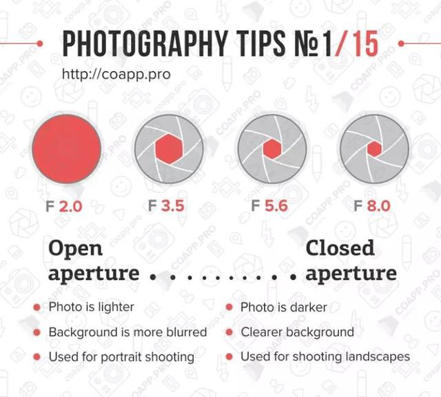
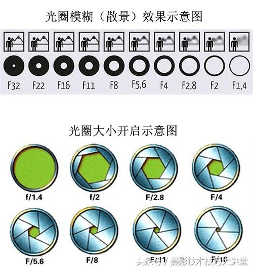
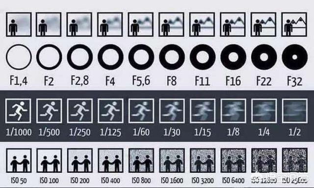
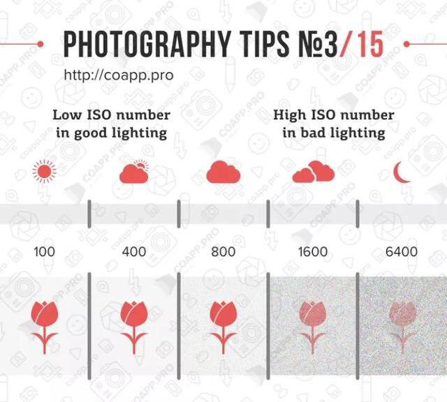
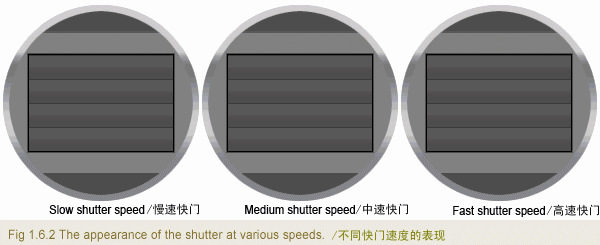
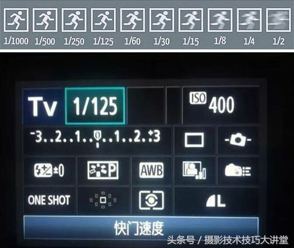
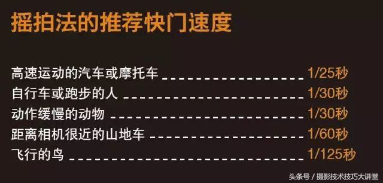
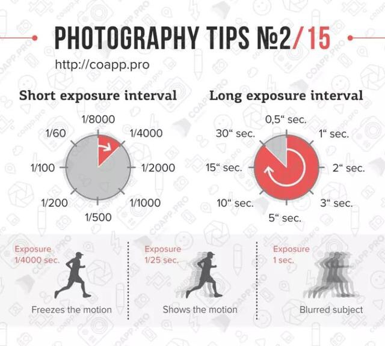
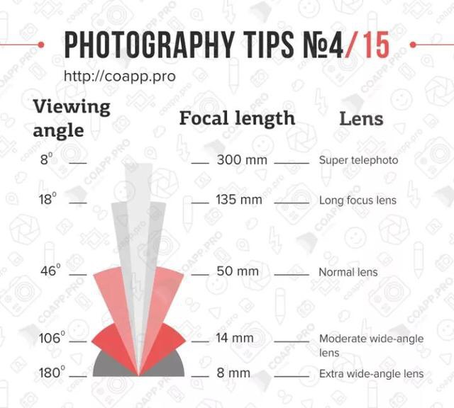
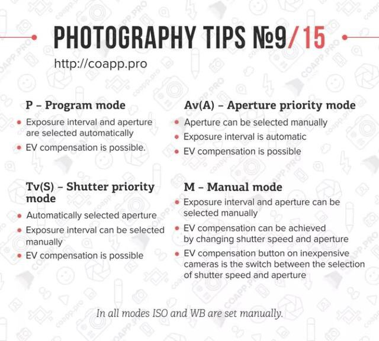

# 图片基础知识

## 分辨率

### 4K：

3840*2160（16:9）

4096*2160

4096*2048

4096*2304

4096*3112

### 1080p：

1920*1080

### 720p：

1280*720

30/60/120/240fps

HDR

White Balance 白平衡：

色温：调节冷暖

色调：

对比度：

高光：

阴影：

白色：

黑色：

清晰度：

自然饱和度：

饱和度：

## **Aperture光圈**：

用来控制光线透过镜头进入机身内感光面光量的装置，通常用f值表达光圈大小。快门不变，f后面的数值越小，光圈越大，进光量越多，画面比较亮，景深越浅，主题背景虚化越大。

光圈f值=镜头焦距/镜头通光直径

## ISO感光度：

数值越小，画面质量越好，数值越高，感光速度越快，画面质量下降，容易产生躁点。在光照暗的夜晚或者黑的场合提高ISO，但是一般宁可光圈开大一级，ISO尽量用低值，这样最大限度保证照片画质。

不要太高（小于800）与噪点紧密

低ISO 50/100/200 吸光能力低，讯噪非常少，物件边缘清晰，适合在日间风景/夜景脚架长曝拍摄。

中ISO 400/800/1000 吸光能力正常，讯噪小，物件边缘清晰，适合在阴天/明亮的室内拍摄。

高ISO 1600/3200/6400吸光能力高，暗部有可见的讯噪，适合在光线不足/室内/手持夜景拍摄。

超高ISO 56000/128000/512000 吸光能力非常高，讯噪严重，适合在光线严重不足/星空照构图拍摄。

## **Shutter快门速度/曝光**：

就是快门从开启到关闭的瞬间，也就是光线进入相机的曝光时间。一般在光线较差的地方如室内和晚上时就需要慢速度，在光线强烈的环境拍摄是需要较快的快门速度。

快门

速度不超过1秒

## 焦距

镜头的焦距越长，视角就越窄，反之亦然。例如300mm的超远摄镜头，只有8°的视角，而8mm的超广角镜头，则拥有180°的视角

## 拍摄模式：

**P模式：**相机自动测光后，按入光量运算出快门和光圈数值。

**A/AV模式：**光圈优先，用户可自行选择光圈大小，相机会自动运算快门速度。

**S/TV模式：**快门优先，用户可自行选择快门速度，相机会自动运算光圈大小。

**M****模式：**全手动模式，用户可自行选择光圈大小和快门速度。

