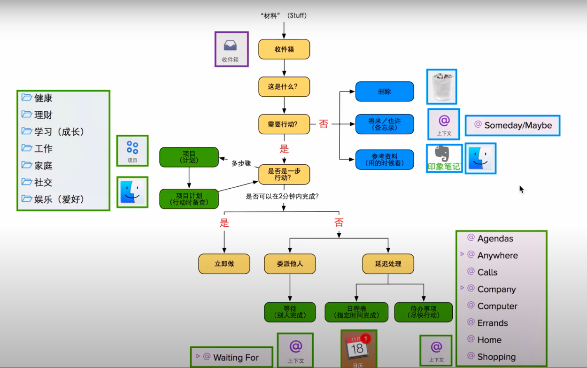

# Omnifocus 使用流程

## 流程

- 将脑子里的事情一股脑全部放进收件箱
- 清空收件箱

- 生成一些待办清单
  - 今日待办事项清单(还得排出先后顺序)

  - - 被动 - 今天之内必须完成的（due soon和今天做project中available）

    - 被动 - 指定时间今天做的（指定时间project中Defer date在今天的，即就是availiable）

    - 被动 - （有计划地做中今天要做的部分，defer今天）

    - 今天 主动 - 从今天开始可以做的（defer date是今天）

    - 主动检查添加 - 今天具备了条件能做的（前天晚上或第二早检查）

    - - 委托给某人的
      - 等待某人消息的
      - 等待事件发生了做的
      - 有啥了再做的

    - 主动检查添加 - 尽快做当中能做的（前天晚上或第二早检查）

    - 主动检查添加 - 闲了做当中想做的（前天晚上或第二早检查）

## 需要设置的接收事项的

## 可以用来查看跟踪进度的

项目 透视:

可以系统化地知道我有多少事情在进行

Forecast 透视：

可以看到未来的计划

Completed 透视：

可以看到已经完成的

- 已完成清单（按照时间group，按照时间sort）

- - 上月已完成清单
  - 上周已完成清单
  - 本周截止目前已完成清单
  - 昨天已完成清单
  - 今天已完成清单

- 未完成清单（所有推迟至今天以后的事件或所有截止日期在今天以后的事件+所有没有推迟日期和截止日期的事件）

- - 本周待办清单
  - 本月目标清单
  - 本季度目标清单
  - 本年度目标清单

Waiting 透视:

可以跟踪在等待条件的

## 清空收件箱

- 从如下几个方面分析事项的特点

  - 现在能做吗

  - 需要定期重复吗

  - 是一次性提醒吗

  - 需要具备某个条件才可以做

  - - 一段时间内随时可能发生的（需要在这段时间内定期提醒检查）
    - 需要等待一件自己掌控不了的事情完成以后，才能开始进行的（需要在这段时间内定期提醒检查）
    - 时间
    - 地点
    - 人物
    - 事件
    - 生产工具
    - 紧急程度
    - 精力程度

- 现在就做/一步

  > - 给老李发邮件 -> 现在就做

- 已经不需要做了

  > - 买雨伞、但发现有一把 -> 删除

- 指定时间做

  > - 下周二晚7点谢某咨询 -> 放到日程表，在日历中创建事项，设置开始和结束时间，然后在收件箱中删掉

- 指定时间必须完成

- 具备条件做

- 【等待王先生修改网站标题】 -> 创建Waiting 上下文，并设置到期时间

- 【回家了给奶奶买膏药】-> 创建 地点 上下文

- 【买一瓶蜂蜜】-> 创建 网上购物 

- 定期循环

- 尽快做

- 闲了做

- 梦想清单/将来也许【去日本旅游】-> 放进Someday/Maybe 上下文

- 有计划地做/多步【写一本时间管理的书】 -> 创建一个项目，分解第一步出来

- 资料【图片保存】-> 现在就做，保存到自己的资料库的相应位置

- 参考信息

- 灵光一闪

- 需要思考

## 特点

- 紧要程度
  - 紧急重要
  - 紧急不重要
  - 重要不紧急
  - 不重要不紧急
- 精力程度
  - 无脑操作
  - 低能量
  - 沉静思考
- 时间分配
  - 小于5min
  - 5-10min
  - 10-20min
  - 20-30min
  - 30-60min
  - 60-120min
  - 大于120min
- 地点
  - 南孔头
  - 让义村
  - 外出
- 人物