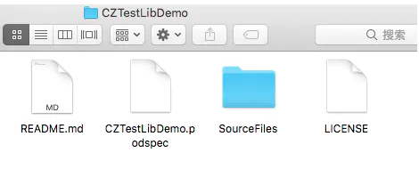

# 制作Pod库

### 1、GitHub创建共有仓库，克隆到本地

### 2、创建podspec文件

> cd 到克隆的库

```
pod spec create CZTestLibDemo
```


### 2.1、配置podspec文件

```
spec.name         = "JLAdditions"
  spec.version      = "1.0.0"
  spec.summary      = "整理的一些常用的分类方法"
  spec.description  = <<-DESC
  整理的一些常用的分类方法,希望能够帮助到大家
                   DESC

  spec.homepage     = "https://joyawang.github.io/ThinkTank/"
  # spec.screenshots  = "www.example.com/screenshots_1.gif", "www.example.com/screenshots_2.gif"

  spec.license      = { :type => "MIT", :file => "LICENSE" }

  spec.author             = { "Joya" => "244092911@qq.com" }
  spec.platform     = :ios, "8.0"
  spec.ios.deployment_target = "8.0"

   # 源库资源文件所在位置
  spec.source       = { :git => "https://github.com/JoyaWang/JLAdditions.git", :tag => "#{spec.version}" }
  # 源库资源文件
  spec.source_files  = "SourceFiles", "SourceFiles/**/*.{h,m}"
  spec.exclude_files = "SourceFiles/Exclude"
  
```

> 特别说明：在source_files这一点 s.source_files = 'SourceFiles'
>
> 是因为有的同学可能会遇到下面的错误，怎么都无法解决： ERROR | [iOS] file patterns: The `source_files` pattern did not match any file. 
>
> s.source_files 是存放库资源文件的。这里指向SourceFiles文件夹，里面随便放入一个OC类即可。

> **特别提醒: 还需创建一个LICENSE文件，做版权声明的。**

库文件夹中完整目录如下



### 3、本地库验证

**通过终端，在CZTestLibDemo文件夹里面执行下面命令：
**

> **pod lib lint CZTestLibDemo.podspec**

如果有警告（WARN），需要根据提示内容解决警告，忽略警告 

> **pod lib lint CZTestLibDemo.podspec --allow-warnings**

执行成功会提示： **CZTestLibDemo passed validation** 

### 4、推送打标签

**通过终端，在CZTestLibDemo文件夹里面执行下面命令：
**

> **git add .**
>
> **git commit -m "1.0"**
>
> **git push**

> **git tag -m 'release version 1.0.0' 1.0.0**
>
> **git push origin 1.0.0**

### 5、验证podspec文件

**通过终端，在CZTestLibDemo文件夹里面执行下面命令：
**

> **pod spec lint CZTestLibDemo.podspec**

### 6、注册，推送podspec到cocoapods，搜索验证

通过终端，在CZTestLibDemo文件夹里面执行下面命令：

> **pod trunk register [email] ‘用户名’ --description='描述，可不填'**
>
> **example**
>
> **pod trunk register 123@qq.com 'wnkpzzz' --description='MacBook Pro'
> **

之后会给你发送一条邮箱，进行确认，这里的-**-description='MacBook Pro'**可以省略，复制邮箱的链接

查看个人信息。通过终端，执行下面命令：

> **pod trunk me**

**推送podspec到Cocoapods** 

通过终端，在CZTestLibDemo文件夹里面执行下面命令：

> **pod trunk push CZTestLibDemo.podspec**

### 7、搜索验证

> **pod search CZTestLibDemo
> **

如果发现搜索不到出现如下提示：

> [!] Unable to find a pod with name, author, summary, or description matching `CZTestLibDemo`

解决方法：

> //删除本地索引
>
> **rm ~/Library/Caches/CocoaPods/search_index.json
> **
>
>   //搜索
>
>  **pod search [库名]
> **
>
>   //更新索引
>
>   **pod repo update** 