# 制作静态库

## 制作.a静态库

[制作.a静态库](https://www.jianshu.com/p/2e72a20b95aa)

## 制作.framework

[iOS 静态库.a制作以及打包bundle文件](https://www.jianshu.com/p/eedbd9dd6d20)

1. ### 新建工程，创建Framework库工程

   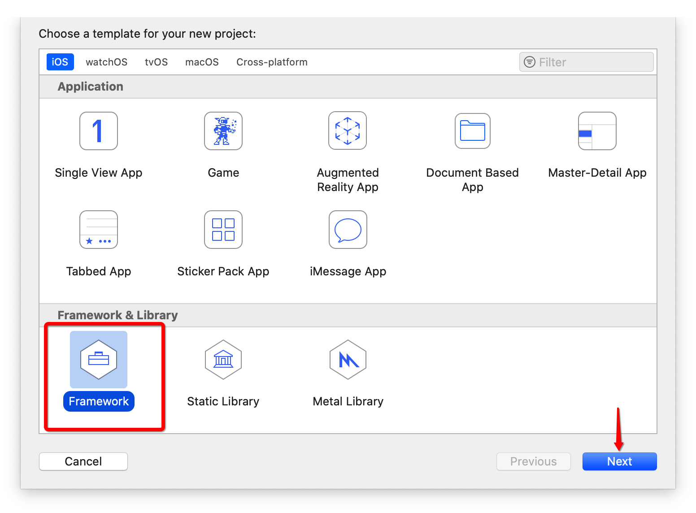

   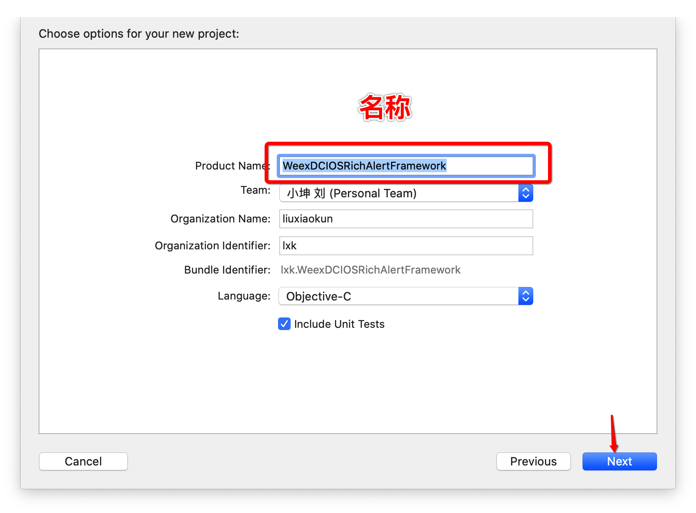

2. ### 往工程中添加文件

   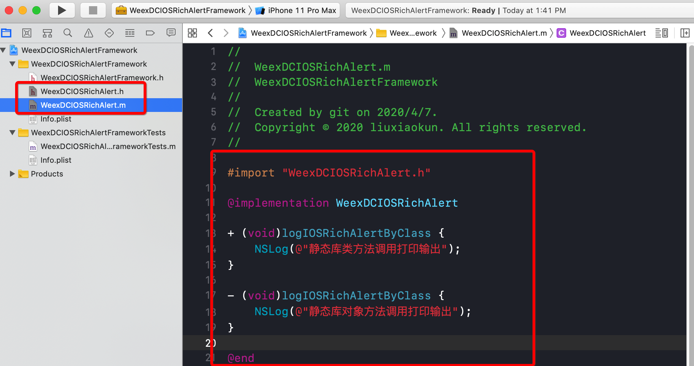

3. ### 设置相关项

   > TARGETS -> General -> Deployment Info -> Deploymnet Target
   >
   > 调整最低支持的iOS系统
   >
   > 
   >
   > TARGETS -> Build Settings
   >
   > - 添加可能缺失的Architectures架构
   >
   > - Build Active Architecture Only 设置为No，意思是当前打包的.framework支持所有设备，否则打包时只支持当前版本的真机或模拟器的架构
   >
   >   
   >
   > - 搜索linking，设置Dead Code Stripping为No，是编译选项优化，包瘦身(可不改)
   >
   > - Mach-O Type 选中 StaticLibrary (静态库)，Xcode默认为动态库
   >
   > TARGETS -> Build Phases
   >
   > - 设置要公开的头文件, 将需要呈现给来的头文件,直接从Project拖到Public中. 不想呈现出来的.h文件不建议拖到Private中. 放在project中即可

   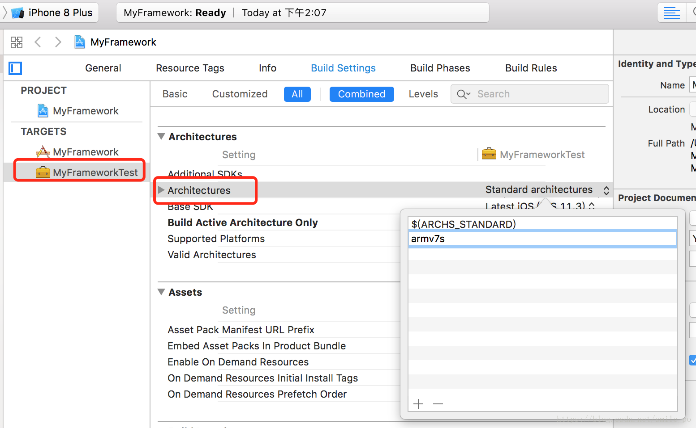

   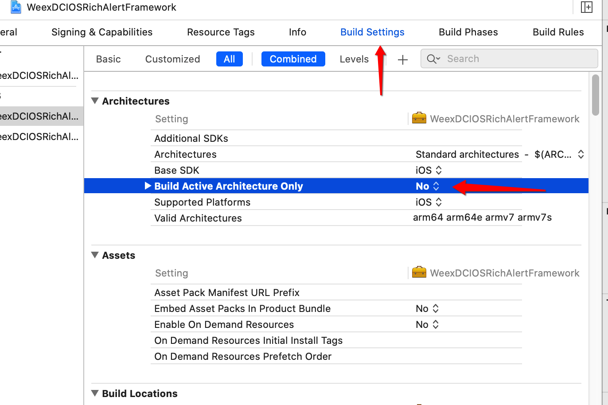

   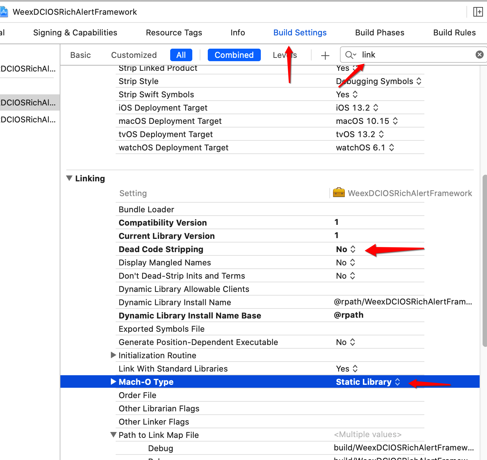

   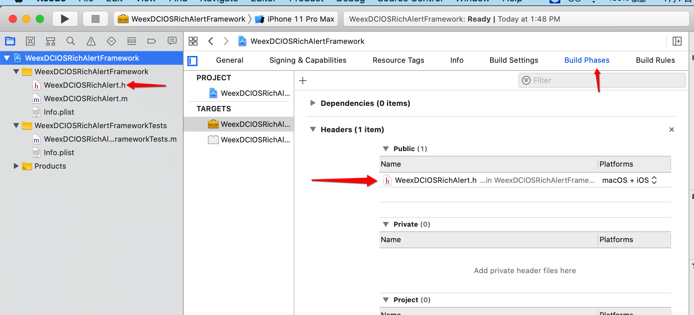

4. ### 在进行编译之前应该设置为release模式 快捷键(command + shift + ,)

   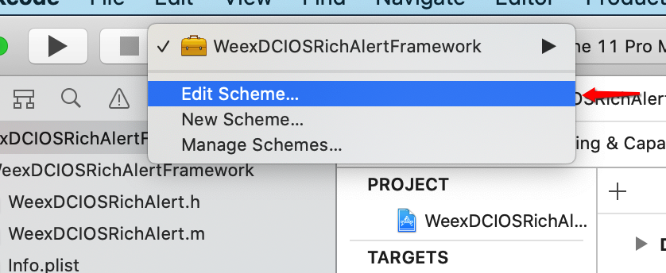

   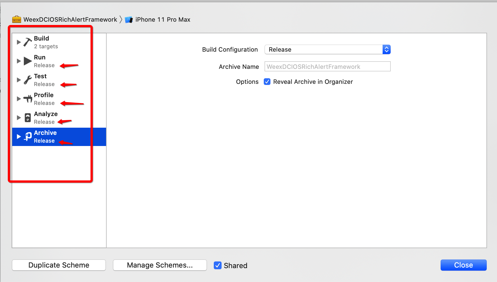

5. ### 编译生成.framework

   > 分别在真机和模拟器状态下按(command + B)编译生成.Framework文件

   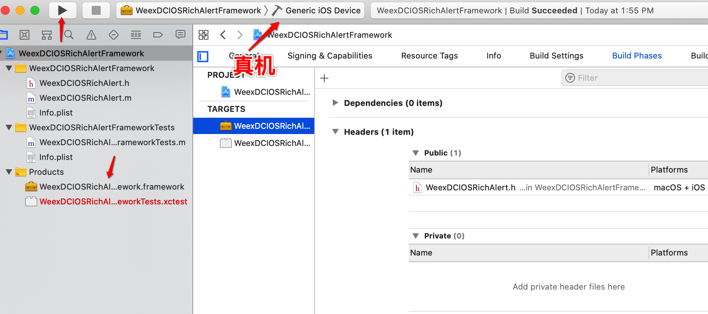

   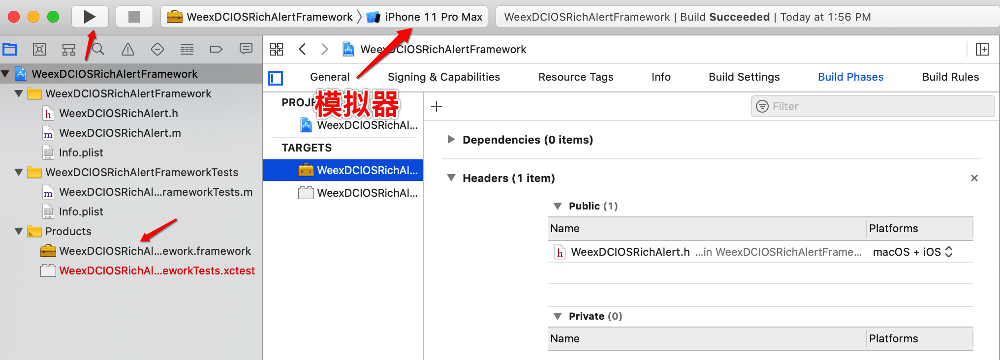

6. ### 获取.framework文件夹

   > 右键点击“项目” - "Products"文件夹中生成的WeexDCIOSRichAlertFramework.Framework文件，"Show in Finder"
   >
   > 打开后会有分别生成的真机Release-iphoneos和模拟器Release-iphonesimulator的.Framework文件
   >
   > .frame文件夹中的二进制文件才是库文件

   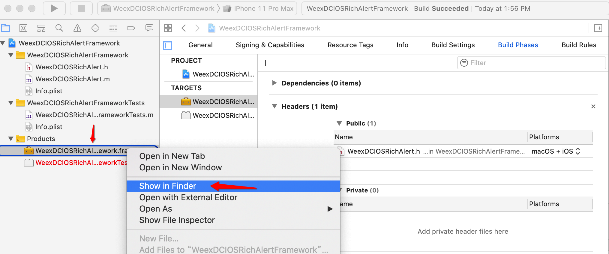

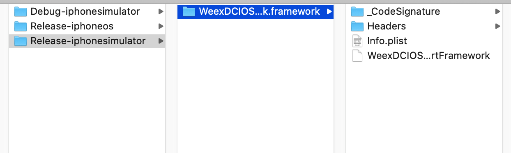


7. ### 真机版本和模拟器版本framework合并

   > sudo lipo -create 真机framework文件路径 模拟器framework文件路径 -output 要输出的文件路径

   ```
   sudo lipo -create /Users/joyawang/Desktop/OCAdditions/Release-iphoneos/OCAdditions.framework/OCAdditions /Users/joyawang/Desktop/OCAdditions/Release-iphonesimulator/OCAdditions.framework/OCAdditions -output /Users/joyawang/Desktop/OCAdditions/OCAdditionsFrame
   ```

   

8. ### 在项目中使用

   > 可能要根据库中类的不同，在Build Settings -> Other Linker Flags使用不同的链接参数
   >
   > - -ObjC
   >
   > - -all_load
   >
   > - -force_load 库文件路径
   >
   >   -force_load $(PROJECT_DIR)/测试的/Frameworks/OCAdditions.framework/OCAdditions

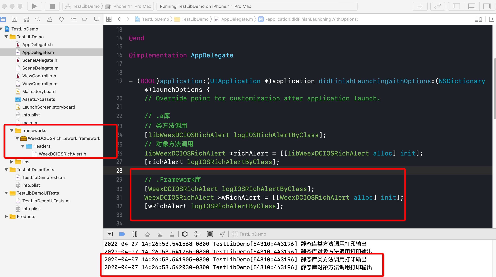


