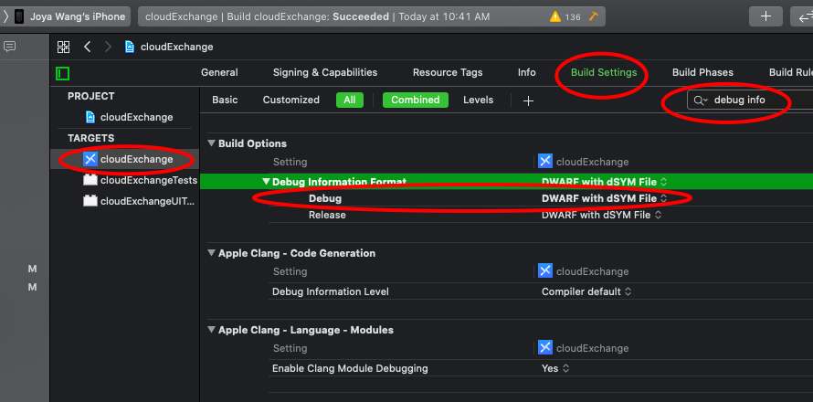
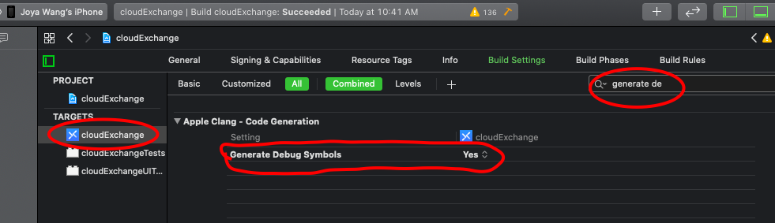
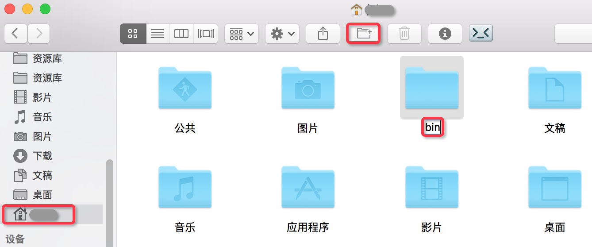
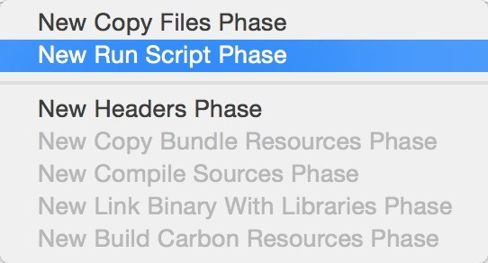
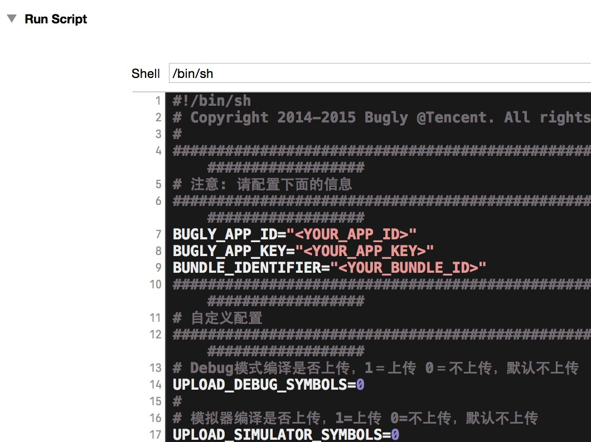
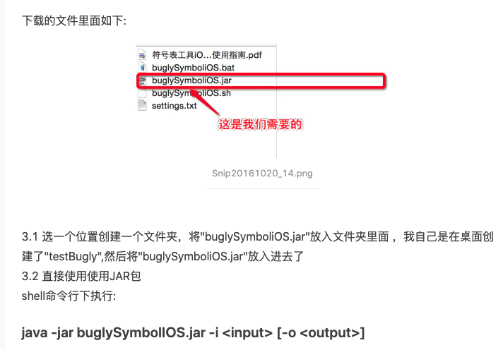

# Bugly

## SDK 集成

Bugly提供两种集成方式供iOS开发者选择：

- 通过CocoaPods集成
- 手动集成

如果您是从`Bugly 2.0`以下版本升级过来的，请查看[iOS SDK 升级指南](https://bugly.qq.com/docs/user-guide/upgrading-2.x-ios/)

> Bugly iOS SDK 最低兼容系统版本 **iOS 7.0**

#### 通过CocoaPods集成

在工程的`Podfile`里面添加以下代码：

```
pod 'Bugly'
```

保存并执行`pod install`,然后用后缀为`.xcworkspace`的文件打开工程。

> 注意:
>
> **命令行下执行`pod search Bugly`,如显示的`Bugly`版本不是最新的，则先执行`pod repo update`操作更新本地repo的内容**
>
> 关于`CocoaPods`的更多信息请查看 [CocoaPods官方网站](https://cocoapods.org/)。

#### 手动集成

- 下载 [Bugly iOS SDK](https://bugly.qq.com/docs/release-notes/release-ios-bugly/)
- 拖拽`Bugly.framework`文件到Xcode工程内(请勾选`Copy items if needed`选项)
- 添加依赖库
  - `SystemConfiguration.framework`
  - `Security.framework`
  - `libz.dylib` 或 `libz.tbd`
  - `libc++.dylib` 或 `libc++.tbd`

## 初始化SDK

#### 导入头文件

在工程的`AppDelegate.m`文件导入头文件

> ```
> #import <Bugly/Bugly.h>
> ```
>
> **如果是`Swift`工程，请在对应`bridging-header.h`中导入**

#### 初始化Bugly

在工程`AppDelegate.m`的`application:didFinishLaunchingWithOptions:`方法中初始化：

- **Objective-C**

```
- (BOOL)application:(UIApplication *)application didFinishLaunchingWithOptions:(NSDictionary *)launchOptions {
    [Bugly startWithAppId:@"此处替换为你的AppId"];
    return YES;
}
```

- **Swift**

```
func application(application: UIApplication, didFinishLaunchingWithOptions launchOptions: [NSObject: AnyObject]?) -> Bool {
    Bugly.startWithAppId("此处替换为你的AppId")
    return true
}
```

如果您需要上报`iOS Watch2 App`或`iOS App Extension`的异常，请参见 [Bugly iOS Extension SDK 接入指南](https://bugly.qq.com/docs/user-guide/instruction-manual-ios-app-extension/)。


## 配置符号表

> 每次Build都会生成一个App和其对应的dSYM文件，每个dSYM文件都有自己的UUID，每一次crash对应的App都有自己特定UUID的dSYM文件。
>
> 默认debug模式不生成dSYM文件，可通过以下两步开启






### 自动配置：XCode + sh脚本【[需要手动配置的话点这里](https://bugly.qq.com/docs/user-guide/symbol-configuration-ios/?v=20200312155538#xcode-sh)】

自动配置请首先下载和解压[自动配置符号表工具包](https://bugly.qq.com/v2/sdk?id=6ecfd28d-d8ea-4446-a9c8-13aed4a94f04)，然后选择上传方式并配置Xcode的编译执行脚本。

#### 1. 上传方式【可以啥都不弄，即选默认，直接进行第二步?】

使用脚本自动配置支持两种上传方式：

- 方式一：直接上传dSYM文件（默认方式 ）
- 方式二：提取dSYM文件的符号表文件并上传

其中，使用方式二需要额外操作以下几步：

- 下载符号表提取工具依赖的[Java运行环境](http://www.oracle.com/technetwork/java/javase/downloads/jdk8-downloads-2133151.html)（JRE或JDK版本需要>=1.6）

- 把工具包`buglySymbolIOS.jar`保存在用户主目录（Home）的`bin`目录下（没有`bin`文件夹,请自行创建）:

  

#### 2. 配置Xcode编译执行脚本

- 在Xcode工程对应Target的`Build Phases`中新增`Run Scrpit Phase`

  

- 打开工具包中的`dSYM_upload.sh`，复制所有内容，在新增的`Run Scrpit Phase`中粘贴

- 修改新增的`Run Scrpit`中的 `<YOUR_APP_ID>` 为您的App ID，`<YOUR_APP_KEY>`为您的App Key，`<YOUR_BUNDLE_ID>` 为App的Bundle Id

  

脚本默认在**Debug**模式及**模拟器编译**情况下不会上传符号表，在需要上传的时候，请修改下列选项

- Debug模式编译是否上传，1＝上传 0＝不上传，默认不上传

  `UPLOAD_DEBUG_SYMBOLS=0`

- 模拟器编译是否上传，1＝上传 0＝不上传，默认不上传

  `UPLOAD_SIMULATOR_SYMBOLS=0`

至此，自动上传符号表脚本配置完毕，Bugly 会在每次 Xcode 工程编译后自动完成符号表配置工作。


### 手动配置

1. 首先看那次crash的对应的app的dSYM文件的uuid
2. 在配置好debug模式下可生成dSYM文件后，在生成的app的文件夹中找到dSYM文件。

3. 用下面代码可查看此dSYM文件的uuid

```
查看dSYMs文件的UUID
dwarfdump --uuid 【路径】
dwarfdump --uuid /Users/joyawang/Library/Developer/Xcode/Archives/2020-06-12/cloudExchange\ 2020-6-12\,\ 10.09\ PM.xcarchive/dSYMs/信企贵交.app.dSYM
```

4. uuid匹配的话，用bugly提供的工具将dSYM文件生成bugly需要的格式，是个zip包

   > [Bugly iOS符号表工具](https://bugly.qq.com/v2/sdk?id=37f16cf0-2020-4e30-9e8d-0f7de59cfe94)
   >
   > 

```
java -jar 【jar文件地址/buglySymboliOS.jar】 -i 【dSYM文件地址/xxx.dSYM】
java -jar buglySymboliOS.jar -i /Users/joyawang/Library/Developer/Xcode/Archives/2020-06-12/cloudExchange\ 2020-6-12\,\ 10.09\ PM.xcarchive/dSYMs/信企贵交.app.dSYM
```

5. 在bugly页面上传生成的zip包