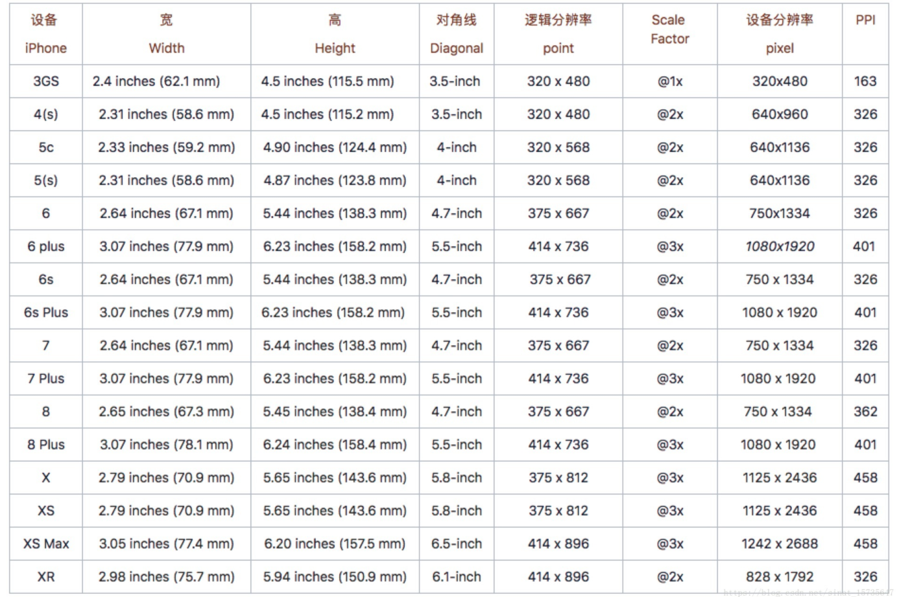
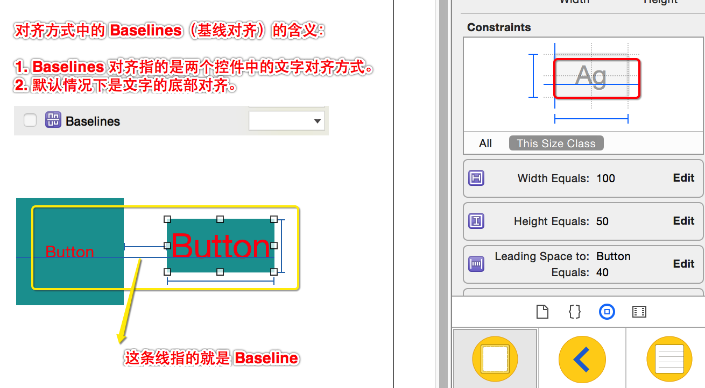

# iOS屏幕适配

系统适配是指，适配后，针对iOS某个版本的系统可运行

屏幕适配：

如果用frame设置控件的大小，写死成具体的点，不同的屏幕就会出现显示问题。

UI界面上控件布局好以后，且只布局一次，无论在iPhone或者iPad，无论竖屏还是横屏，都能正常显示。

无论AutoResizing还是AutoLayout，最后都是根据参照约束计算出了控件的frame，也就是间接设置了控件的frame，所以一旦使用autoresizing或者autolayout了，就不要直接设置frame了，否则可能产生混乱。

Autoresizing和Autolayout互斥，当使用autoresizing时必须禁用autolayout，当使用autolayout时，无法使用autoresizing

## 屏幕适配发展历程

### 一、 直接使用frame计算控件的位置、大小(Magic Number) 
1. iPhone3Gs\iPhone4\iPhone4S 屏幕的*物理尺寸是一样的(无需屏幕适配)*，而且一个应用要么是横屏要么是竖屏，不存在能同时进行横竖屏切换的应用。

### 二、使用autoresizing进行屏幕适配(只能参照父控件设置参照，不能参照兄弟控件设置)
1. 随着iPad的发布，*屏幕物理大小发生了变化*，并且要求部分应用程序实现*横竖屏切换*，所以不能把控件的frame都写死了，需要进行屏幕适配。
2. autoresizing的核心思想就是：参照父容器来设置子控件的frame。不再写死frame，而是*参照*。
3. 举例：在竖屏下有一个按钮要占据整个屏幕宽度，当切换到横屏下以后同样要占据整个屏幕的宽度
4. *注意：autoresizing只能设置当前控件与父控件之间的相对关系*

### 三、使用autolayout(从iOS6开始)进行屏幕适配
1. 随着iPhone5\iPhone5S等的发布，苹果设备*不同尺寸的屏幕变的越来越多*，不仅要求能根据控件父子关系来设置相对位置，也要求能*根据任意控件之间的关系来设置位置*
2. 因为autoresizing只能设置当前控件与父控件之间的相对关系，当遇到要设置兄弟控件之间的关系的时候，autoresizing就无能为力了。
3. 举例：在竖屏下，屏幕底部有两个按钮，这两个按钮的间距为一个固定的值(宽度不指定)；当切换为横屏的时候要求这两个按钮还显示在屏幕底部，并且按钮间的间距不变，按钮可以随之变宽。

### 四、使用size classes + autolayout 进行屏幕适配

size classes技术主要解决的问题：*为不同尺寸的屏幕，通过autolayout设置不同的约束。*

1. 当iPhone6发布以后，苹果设备的屏幕越来越多(以后也可能出现更多不同大小的屏幕)，为了能更容易的适配不同的屏幕，苹果推出了size classes技术
3. 通过autolayout设置的约束，约束一旦添加就会应用于各种屏幕(也就是在各种不同的屏幕下都使用相同的约束)。
4. 通过size classes + autolayout的方式，*可以为不同尺寸的屏幕设置不同的约束*。
举例：在3.5 inch的屏幕下希望某个按钮紧贴屏幕上边显示，但是当屏幕变成4.7 inch以后，则希望该按钮显示到屏幕的正中央。

