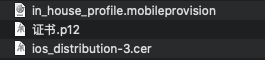
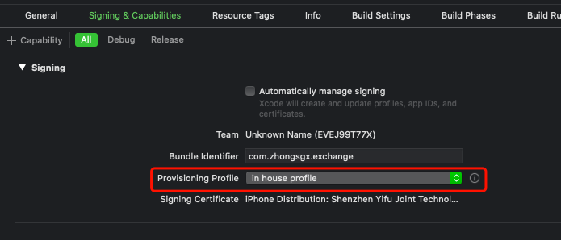
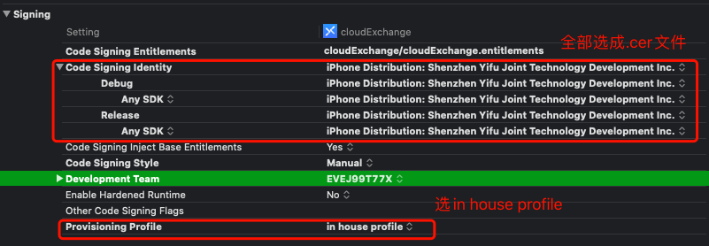

# 打企业版ipa包七牛云分发流程

- 打企业包前准备

  > 用企业开发者账号，生成以下三个文件
  >
  > - in_house_profile.mobileprovision 描述文件
  > - ios_distribution-3.cer 发布证书文件?【在要打包的电脑上双击打开】
  > - 证书.p12 文件【在要打包的、但未登录此企业开发者账号的电脑上双击打开】

  

- 要修改的信息

  > - 环境更新
  > - Display Name
  > - Bundle Identifier【Targets-MyApp-General-Identity】
  > - Version【Targets-MyApp-General-Identity】
  > - Build【Targets-MyApp-General-Identity】

  

- Targets-MyApp-Signing & Capbilities

  > - 取消 Automatically manage signing
  >
  > - Provisioning Profile 项选择准备好的 in house profile 文件
  >
  >   > 如果出现private key相关的问题，则是.p12文件的问题

  

- Targets-MyApp-Build Setting

  > - Signing
  >   - Code Signing Identity 全部选择准备好的.cer文件
  >   - Provisioning Profile 选择准备好的 in house profile文件

  

- 配置Bugly
  - 将Bugly启动的appId换成自己的
  - 在Targets-MyApp-BuildPhases-Run Script 中修改 Bugly的App_ID, APP_KEY, BundleID

- 取消所有的断点

- 在Edit Scheme那里改为Release模式

- Shift +  Command + k 清理一下

- 选择 Generic iOS Device，Product - Archive, 开始打包

- 备份App对应的dSYM文件

- 分发

- 配置一个plist文件
  - url外链 【ipa文件的下载地址】
  - bundle-identifier 【BundleID】
  - bundle-version 【App版本】
  - title 【App名称】
  
- 在后台配置一下要更新的版本信息，这样iOS端才能检测到要更新

```
http://res.zhongsgx.com/package/1/cloudExchange.ipa
http://res.xinqgj.com/xqgj/1/xqgj_operation.html 

https://www.xinqgj.com/downapp
https://xinqgj.com/down/zwy-ios.plist
http://res.xinqgj.com/package/1/cloudExchange.ipa

```


```objc
// https://xinqgj.com/down/zwy-ios.plist
dispatch_after(dispatch_time(DISPATCH_TIME_NOW, (int64_t)(2 * NSEC_PER_SEC)), dispatch_get_main_queue(), ^{
        UIApplication *application = [UIApplication sharedApplication];
        [application openURL:[NSURL URLWithString:[NSString stringWithFormat:@"itms-services://?action=download-manifest&url=https://你的plist外链接地址.plist"]]];
        exit(0);
    });
```


```xml
<?xml version="1.0" encoding="UTF-8"?>
<!DOCTYPE plist PUBLIC "-//Apple//DTD PLIST 1.0//EN" "http://www.apple.com/DTDs/PropertyList-1.0.dtd">
<plist version="1.0">
<dict>
    <key>items</key>
    <array>
        <dict>
            <key>assets</key>
            <array>
                <dict>
                    <key>kind</key>
                    <string>software-package</string>
                    <key>url</key>
                    <string>ipa文件的外链，这个外链可以不是https的，也就是说http即可</string>
                </dict>
                <dict>
                    <key>kind</key>
                    <string>full-size-image</string>
                    <key>needs-shine</key>
                    <true/>
                    <key>url</key>
                    <string></string>
                </dict>
                <dict>
                    <key>kind</key>
                    <string>display-image</string>
                    <key>needs-shine</key>
                    <true/>
                    <key>url</key>
                    <string></string>
                </dict>
            </array>
            <key>metadata</key>
            <dict>
                <key>bundle-identifier</key>
                <string>你的bundleID</string>
                <key>bundle-version</key>
                <string>1.2.0</string>
                <key>kind</key>
                <string>software</string>
                <key>subtitle</key>
                <string>App</string>
                <key>title</key>
                <string>app名称</string>
            </dict>
        </dict>
    </array>
</dict>
</plist>
```

