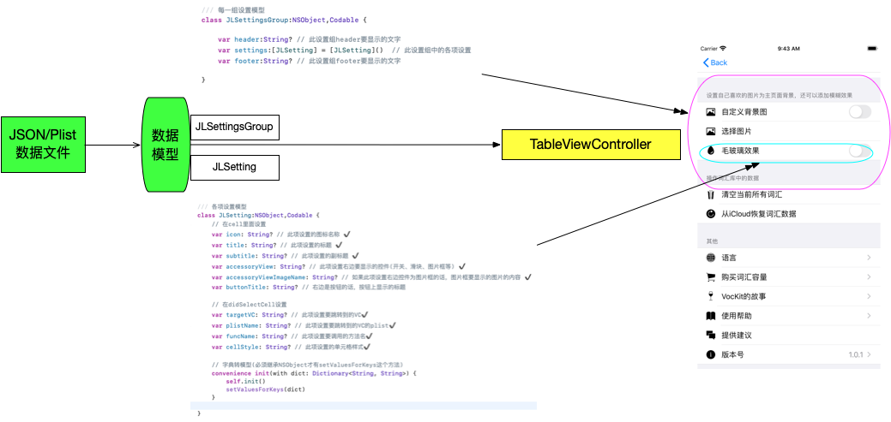

# 用JSON或Plist数据动态创建列表


### 流程图




### 组成部分

数据文件: SettingsList

视图控制器：JLSettingsController

自定义cell: JLSettingTableViewCell

数据模型: JLSettingsGroup、JLSetting


```json
# SettingsList
[
  {
    "header": "",
    "settings": [
      {
        "icon": "",
        "title": "获取区块链信息",
        "subtitle": "",
        "accessoryView": "",
        "targetVC": "",
        "plistName": "",
        "funcName": "getChainInfo",
        "cellStyle": "",
        "bottonTitle": ""
      },
      
      {
        "icon": "",
        "title": "创建钱包",
        "subtitle": "",
        "accessoryView": "",
        "targetVC": "",
        "plistName": "",
        "funcName": "createWallet",
        "cellStyle": "",
        "bottonTitle": ""
      },
      {
        "icon": "",
        "title": "导入私钥同时创建钱包",
        "subtitle": "",
        "accessoryView": "",
        "targetVC": "",
        "plistName": "",
        "funcName": "importPrivateKey",
        "cellStyle": "",
        "bottonTitle": ""
      },
      {
        "icon": "",
        "title": "创建密钥对",
        "subtitle": "",
        "accessoryView": "",
        "targetVC": "",
        "plistName": "",
        "funcName": "generateKeyPairs",
        "cellStyle": "",
        "bottonTitle": ""
      },
      {
        "icon": "",
        "title": "创建账户",
        "subtitle": "",
        "accessoryView": "",
        "targetVC": "",
        "plistName": "",
        "funcName": "creatAccount",
        "cellStyle": "",
        "bottonTitle": ""
      },
      {
        "icon": "",
        "title": "查询账户余额",
        "subtitle": "",
        "accessoryView": "",
        "targetVC": "",
        "plistName": "",
        "funcName": "getBalance",
        "cellStyle": "",
        "bottonTitle": ""
      },
      {
        "icon": "",
        "title": "转账",
        "subtitle": "",
        "accessoryView": "",
        "targetVC": "",
        "plistName": "",
        "funcName": "transferMoney",
        "cellStyle": "",
        "bottonTitle": ""
      }
    ],
    "footer": ""
  }
]

```


```swift
//
//  JLSettingsController.swift
//  VocKit
//
//  Created by Joya Wang on 2019/12/14.
//  Copyright © 2019 Joya Wang. All rights reserved.
//

import UIKit
import SVProgressHUD


let settingCellID = "setting_cell"

class JLSettingsController: UITableViewController,UIPickerViewDelegate,UIImagePickerControllerDelegate,UINavigationControllerDelegate, UIDocumentPickerDelegate, JLSettingTableViewCellProtocol {
    
    
    // MARK: 方法监听
    
    lazy var rpcService:RPCService = {
        let rs = RPCService()
        EOSRPC.endpoint = "http://192.168.3.9:8888"
        return rs
    }()
    
    // 会调用到的方法字典用closure
    lazy var options = [
        "getChainInfo" : {self.rpcService.getChainInfo()},
        "createWallet" : {self.rpcService.createWallet()},
        "importPrivateKey" : {self.rpcService.importPrivateKey()},
        "generateKeyPairs" : {self.rpcService.generateKeyPairs()},
        "creatAccount" : {self.rpcService.creatAccount()},
        "getBalance" : {self.rpcService.getBalance()},
        "transferMoney" : {self.rpcService.transferMoney()}
    ]
    
    
    func toggleSwitch(_ cell: JLSettingTableViewCell) {
        
    }
    
    var plistName: String?
    
    lazy var settingGroups: [JLSettingsGroup] = {
        // 获取plist的url
        if let plistName = plistName, plistName.count > 0 {
            let path = Bundle.main.path(forResource: plistName, ofType: "json")!
            let url = URL(fileURLWithPath: path)
            let data = try! Data(contentsOf: url)
            return try! JSONDecoder().decode([JLSettingsGroup].self, from: data)
        }
        return [JLSettingsGroup]()
    }()
    
    init() {
        super.init(style: UITableView.Style.grouped)
    }
    
    required init?(coder: NSCoder) {
        fatalError("init(coder:) has not been implemented")
    }
    
    override func viewDidLoad() {
        super.viewDidLoad()
            
        self.tableView.register(JLSettingTableViewCell.self, forCellReuseIdentifier: settingCellID)
    }
    
    // MARK: - Table view data source
    
    override func numberOfSections(in tableView: UITableView) -> Int {
        // #warning Incomplete implementation, return the number of sections
        return self.settingGroups.count
    }
    
    override func tableView(_ tableView: UITableView, numberOfRowsInSection section: Int) -> Int {
        // #warning Incomplete implementation, return the number of rows
        
        return self.settingGroups[section].settings.count
    }
    
    
    override func tableView(_ tableView: UITableView, cellForRowAt indexPath: IndexPath) -> UITableViewCell {
        
        // 获取模型
        let setting = self.settingGroups[indexPath.section].settings[indexPath.row]
        
        // 先设置一个全局的cellStyleS，在cell初始化时使用
        cellStyle = setting.cellStyle
        
        // 创建单元格
        let cell = tableView.dequeueReusableCell(withIdentifier: settingCellID, for: indexPath) as? JLSettingTableViewCell
        // 单元格可能要调用控制器中的方法，得将此控制器设置为它的代理
        cell?.delegate = self
        
        // 给单元格设置模型
        cell?.setting = setting
        
        return cell!
    }
    
    
    override func tableView(_ tableView: UITableView, didSelectRowAt indexPath: IndexPath) {
        // 获取模型
        let setting = self.settingGroups[indexPath.section].settings[indexPath.row]
        
        // 如果此项设置需要调用一个方法
        if let funcName = setting.funcName {
            options[funcName]?()
        }
        // 如果此项设置需要跳到另一个VC
        if let vcName = setting.targetVC, vcName.count > 0 {
            let vc = JLSettingsController()
            vc.plistName = setting.plistName
            self.navigationController?.pushViewController(vc, animated: true)
        }
        tableView.cellForRow(at: indexPath)?.setSelected(false, animated: true)
    }
    
    override func tableView(_ tableView: UITableView, titleForHeaderInSection section: Int) -> String? {
        // 获取模型
        let settingGroup = self.settingGroups[section]
        return settingGroup.header
    }
    override func tableView(_ tableView: UITableView, titleForFooterInSection section: Int) -> String? {
        // 获取模型
        let settingGroup = self.settingGroups[section]
        return settingGroup.footer
    }
    
    
    // MARK: - ******点击单元格右边的按钮(如果有的话)******
    func accessoryButtonClicked(_ cell: JLSettingTableViewCell) {
        
    }
    
}

```


```swift
//
//  JLSetting.swift
//  VocKit
//
//  Created by Joya Wang on 2019/12/14.
//  Copyright © 2019 Joya Wang. All rights reserved.
//

import Foundation


/// 每一组设置模型
class JLSettingsGroup:NSObject,Codable {
        
    var header:String? // 此设置组header要显示的文字
    var settings:[JLSetting] = [JLSetting]()  // 此设置组中的各项设置
    var footer:String? // 此设置组footer要显示的文字
    
}


/// 各项设置模型
class JLSetting:NSObject,Codable {
    // 在cell里面设置
    var icon: String? // 此项设置的图标名称 ✔️
    var title: String? // 此项设置的标题 ✔️
    var subtitle: String? // 此项设置的副标题 ✔️
    var accessoryView: String? // 此项设置右边要显示的控件(开关、滑块、图片框等) ✔️
    var accessoryViewImageName: String? // 如果此项设置右边控件为图片框的话，图片框要显示的图片的内容 ✔️
    var buttonTitle: String? // 右边是按钮的话，按钮上显示的标题
    
    // 在didSelectCell设置
    var targetVC: String? // 此项设置要跳转到的VC✔️
    var plistName: String? // 此项设置要跳转到的VC的plist✔️
    var funcName: String? // 此项设置要调用的方法名✔️
    var cellStyle: String? // 此项设置的单元格样式✔️
    
    // 字典转模型(必须继承NSObject才有setValuesForKeys这个方法)
    convenience init(with dict: Dictionary<String, String>) {
        self.init()
        setValuesForKeys(dict)
    }

}

```


```swift
//
//  JLSettingTableViewCell.swift
//  VocKit
//
//  Created by Joya Wang on 2019/12/14.
//  Copyright © 2019 Joya Wang. All rights reserved.
//

import UIKit

// 协议必须写class才能设置为weak,必须标记为objc才可以设置optional
protocol JLSettingTableViewCellProtocol:class {
    // 当用户点击单元格右边定制的按钮时调用
    func accessoryButtonClicked(_ cell: JLSettingTableViewCell)
    func toggleSwitch(_ cell: JLSettingTableViewCell)
    
}


// 用来接收从cellForRow传来的cellStyle
var cellStyle:String?
func getCellStyle(with cellStyleName: String?) -> UITableViewCell.CellStyle {
    switch cellStyleName {
    case "subtitle":
        return .subtitle
    case "value1":
        return.value1
    case "value2":
        return .value2
    default:
        return .default
    }
}

class JLSettingTableViewCell: UITableViewCell{

    override init(style: UITableViewCell.CellStyle, reuseIdentifier: String?) {
        super.init(style: getCellStyle(with: cellStyle), reuseIdentifier: reuseIdentifier)
//        selectionStyle = .none
    }
    
    required init?(coder: NSCoder) {
        fatalError("init(coder:) has not been implemented")
    }
    // 某个对象可以将自己设置为cell的代理，这样cell可以调用它的方法
    weak var delegate:JLSettingTableViewCellProtocol?
    
    // 模型
    var setting:JLSetting? {
        didSet{
            if let setting = self.setting {
                if let icon = setting.icon, icon.count > 0 {
                    let imageData = UIImage(named: icon)?.jpegData(compressionQuality: 1)
                    let image = UIImage(data: imageData!, scale: 65)
                    self.imageView?.image = image // 设置图标
                    self.imageView?.contentMode = .scaleAspectFit
                }
                
                self.textLabel?.text = setting.title // 设置标题

                self.detailTextLabel?.text = setting.subtitle // 设置副标题
                
                if let aViewClass = setting.accessoryView { // 设置右边控件
                    switch aViewClass {
                    case "UISwitch":
                        let sw = UISwitch()
                        sw.addTarget(self, action: #selector(toggleSwitch(_:)), for: .valueChanged)
//                        if let title = setting.title {
//                            sw.isOn = Constants.defaults.bool(forKey: title)
//                        }
                        self.accessoryView = sw
                        
                    case "UISlider":
                        self.accessoryView = UISlider()
                    case "UIImageView":
                        let imageView = UIImageView()
                        if let imageName = setting.accessoryViewImageName {
                            imageView.image = UIImage(named: imageName)
                        }
                        self.accessoryView = imageView
                    case "UIButton":
                        let btn = UIButton()
                        btn.setTitle(setting.buttonTitle, for: .normal) // 设置按钮标题
                        btn.titleLabel?.font = UIFont.systemFont(ofSize: 14)
                        btn.setTitleColor(UIColor.systemBlue, for: .normal)
                        btn.setTitleColor(UIColor.systemGray, for: .highlighted)
                        btn.sizeToFit()
                        btn.addTarget(self, action: #selector(accessoryButtonTapped), for: .touchUpInside)
                        self.accessoryView = btn
                    case "checkmark":
//                        let currentLanguage = Constants.defaults.value(forKey: Constants.languageKey) as? String
//                        // 如果没有设置语言时，默认为中文
//                        if currentLanguage == nil {
//                            if setting.title! == "中文" {
//                                self.accessoryType = .checkmark
//                            } else {
//                                self.accessoryType = .none
//                            }
//                        }
                        // 如果已经设置了语言，按照语言设置显示
                        self.accessoryType = .checkmark

//                        if setting.title! == currentLanguage {
//                            self.accessoryType = .checkmark
//                        } else {
//                            self.accessoryType = .none
//                        }
                         
                    case "disclosureIndicator":
                        self.accessoryType = .disclosureIndicator
                    default:
                        break
                    }
                }
                // 如果是版本cell的话
                if setting.title! == "版本号" {
                    self.detailTextLabel?.text = Bundle.main.infoDictionary!["CFBundleShortVersionString"] as? String
                }
            }
        }
    }
    
    // 当用户点击单元格右边的开关时
    @objc func toggleSwitch(_ sender: UISwitch) {
        guard let title = setting?.title, title.count > 0 else { return }
//        Constants.defaults.set(sender.isOn, forKey: title)
        // 还得从vc调用设置主界面背景图的方法
        delegate?.toggleSwitch(self)
    }
    
    // 当用户点击单元格右边定制的按钮时调用
    @objc func accessoryButtonTapped() {
        delegate?.accessoryButtonClicked(self)
    }
    
    override func layoutSubviews() {
        super.layoutSubviews()
        
        // 设置所有imageview的大小相同，不然会有无法对齐的问题
//        self.imageView?.width = 20;
//        self.imageView?.height = 20;
//        if self.imageView?.image != nil {
//            self.textLabel?.x = 54.2
//        }
    }

}

```

