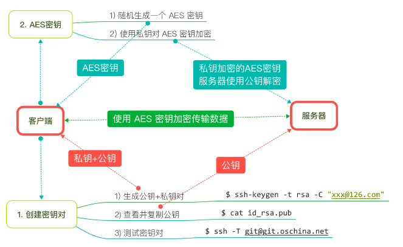

## 项目部署

### 开源中国社区

#### 官方网站

https://git.oschina.net

- 开源中国社区成立于2008年8月，其目的是为中国的IT技术人员提供一个全面的、快捷更新的用来检索开源软件以及交流使用开源经验的平台
- 目前国内很多公司将项目部署在`OSChina`

#### 与 `GitHUB` 对比

1. 服务器在国内，速度更快
2. 免费账户同样可以建立 `私有` 项目，而 GitHUB 上建立私有项目要付费【已免费】

### 使用

- 注册账号

  - 建议使用网易的邮箱，使用其他免费邮箱可能收不到验证码

- 添加 `SSH` 公钥 `Public Key`

  - SSHKey 示意图如下

    

- 开源中国帮助文档地址: [https://git.oschina.net/oschina/git-osc/wikis/帮助#ssh-keys](https://git.oschina.net/oschina/git-osc/wikis/帮助#ssh-keys)

- 进入终端，并输入以下命令

  ```python
  # 生成 RSA 密钥对
  # 1> "" 中输入个人邮箱
  # 2> 提示输入存储密钥对的文件夹名称，直接回车
  # 3> 提示输入密码，可以随便输入，只要本次能够记住即可
     $ ssh-keygen -t rsa -C "xxx@126.com"
  
  # 查看公钥内容
    $ cat ~/.ssh/id_rsa.pub
  ```

- 将公钥内容复制并粘贴到 https://git.oschina.net/profile/sshkeys

- 测试公钥

  ```python
  # 测试 SSH 连接
  $ ssh -T git@git.oschina.net
  # 终端提示 `Welcome to Git@OSC，刀哥` 书名连接成功
  ```

- 新建项目

- 克隆项目

  ```python
  # 切换至项目目录
  $ cd 项目目录[从finder拖拽]
  # 克隆项目，地址可以在项目首页复制
  $ git clone git@git.oschina.net:xxx/ProjectName.git
  ```

- 添加 `gitignore` 

  > 1> 将 Swift.gitignore 复制到项目目录
  > 2> 进入终端
  >
  > ```python
  > # cd 项目目录目录[从finder拖拽]
  > $ mv Swift.gitignore .gitignore
  > ```

-   提示:

  - 从 `http://github.com/github/gitignore` 获取最新版本的 `gitignore` 文件
  - 添加 `.gitignore` 文件之后，每次提交时不会将个人的项目设置信息 (例如：上次代开的文件，调试断点等) 提交到服务器，在团队开发中非常重要

  > 提示: 是否知道 `.gitignore` 是是否有团队开发经验的重要特征
