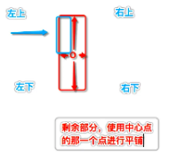

# UIImageView 和 UIImage

- [[UIImageVIew alloc] initWithImage:image] 会根据图像大小设置图像视图的大小！

- ### 图片切片拉伸

  

  - 在 Assets 中切片拉伸

  - 用代码切片拉伸

    ```swift
    // 拉伸图片
    
    let size = bgImage?.size ?? CGSize.zero
    
    let insets = UIEdgeInsets(top: size.height * 0.5, left: size.width * 0.5, bottom: size.height * 0.5, right: size.height * 0.5)
    
    bgImage = bgImage?.resizableImage(withCapInsets: insets)
    
    bgImageSL = bgImageSL?.resizableImage(withCapInsets: insets)
    ```

    

  