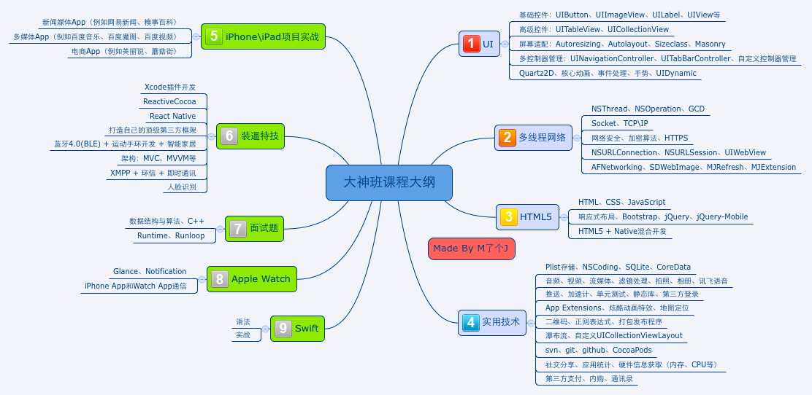

# iOS知识点

## 架构

- MVC
- MVVM
- 从 0 到 1 实现一个 app 的思路
- 对于项目从 main 函数执行之前到之后启动优化，卡顿优化和界面优化

## UI

- UICollectionView 瀑布流
- UITableView 相关的优化，底层原理等
- 页面布局
- layoutSubviews 和 drawRect 等的区别
- 自己实现一个 UIScrollView
- 事件的传递链和响应链
- 界面非常卡顿怎么定位到具体的类和方法
- UIView 和 CALayer 区别
- 页面跳转的方法和区别
- 页面传值的方法和区别

## 数据读取解析存储

- JSON 生成和解析
- PropertyList 生成和解析
- XML 生成和解析
- NSFileManager
- 沙盒
- UserDefaults 用户偏好
- NSCache
- 钥匙串
- 本地数据库
  - FMDB
  - CoreData
  - Realm
  - Firebase

- iCloud

## 内存管理

- ARC 和 MRC 的区别

- @property 属性的关键字 / 修饰符 

  > 他们具体的底层实现以及区别，被问烂的知识点包括

  - copy 
  - 浅拷贝和深拷贝的区别
  - weak 的底层实现
  - assgin 和 weak，assgin是否可以用来修饰对象
  - unsafe_unretained 具体有什么区别
  - Autorelease pool的底层实现原理，与 Runloop 的关系， autoreleasing 关键字

## Block / Closure / 函数指针

- 本质，基础概念
- 使用时要注意的地方
- block的实现，如何截获自动变量的，如何修改自动变量的值的，block的几种形式
- __block的本质
- forwarding 指针
- block怎么避免循环引用。是不是所有的block都会产生循环引用，block里面怎么避免被提前释放

## 多线程、Runloop、自动释放池

- iOS 中多线程的几种方式，区别，使用场景，基本概念，同步异步，串行并行的区别。
- GCD，写一个死锁，并行和串行队列，同步和异步的区别，GCD怎么控制最大并发数
- 怎么让子线程定时执行一个方法，具体的实现方法
- 如何控制线程的最大并发数为10，然后加载十个图片最后展示出来，具体方法
- 子线程的runloop是怎么执行的，它里面的 autoreleasepool 是怎么执行的。
- NSMutableArray 怎么保证线程安全的。
- GCD怎么避免block中的变量被提前释放
- runloop实现原理
- source 类型
- 线程保活的方式
- runloop和多线程的关系，以及timer的关系

## 网络

- 浏览器输入url到网页显示经历了什么过程?
- TCP三次握手：具体是怎么握手？为什么要三次握手？两次行不行？为什么不行？三次握手，第二次和第三次分别因为什么?
- TCP是如何保持可靠传输的（拥塞控制，慢启动等等概念的理解）
- TCP为什么要四次挥手，TIME_WAIT为什么至少设置两倍的MSL时间？
- TCP三次握手的详细数据传递，四次挥手详细数据内容，数据包组成、TIME_WAIT状态，2MSL，RTT，重传、滑动窗口、拥塞原理等等
- TCP、UDP面向连接、无连接具体理解，他们的区别，如何将 UDP 改造成和 TCP 功能相似
- TCP/IP四层协议，OSI七层协议，每层都有啥对应的协议，原理是啥
- http报文结构，http中超文本超是啥意思，http请求的组成
- http 报文头部含有什么，multipart了解吗
- http的状态码，200，304，301，http请求报文，响应报文
- get和post请求的区别？什么情况下用到？POST传输的数据都有哪些格式呢（这里需要搞定http各种请求传输的数据格式）
- 描述一次完整的http请求
- 什么是cookie，什么是session，区别联系，cookie的本质是什么
- http1.0，1.1，2.0的区别
- https有几次握手和挥手？https的原理。http有几次挥手和握手？TLS在哪一网络层，基本原理是什么？
- https与中间人攻击
- HTTPS，安全层除了SSL还有，最新的？ 参数握手时首先客户端要发什么额外参数
- HTTPS是什么？握手过程，SSL原理，非对称加密了解多少
- 证书是干什么用的
- 弱网优化

## Runtime 原理及应用

- KVO 的底层原理，自己实现
- KVC 的底层原理，自己实现
- NSNotification 的底层原理，是同步还是一部，如何实现一个，如果在子线程接收一个通知能不能接收到
- 消息的动态转发
- 给 Category 添加属性，关联对象都有几种形式
- method swizzling
- 怎么获取已上架app崩溃日志？
- 怎么为系统类添加存储属性？
- 说一说类的结构，运行时中的class都有什么属性，property都有什么属性
- 说一说isa指到NSObject的那个过程
- Category的本质，load方法什么时候加载，Category重写了父类的方***怎样，底层源码 ，如果两个Category和一个基类，都有同名方法，先执行哪个
- property会自动生成什么，如果此时已经有下划线_name的实例变量了那会生成什么
- load 和 initialize

## 生命周期

- app 的声生命周期
- 控制器的生命周期
- 视图的生命周期

## OC 语言特性

- OC 和 C 的区别， OC 和 Java、C++ 的区别
- iOS 中的协议
- OC 动态性
- C 语言如何动态的交换两个方法的实现

## 常用功能集成

### 支付

- 支付宝
- 微信
- 银联
- Apple Pay

### 地图

- 百度地图
- 高德地图
- 苹果地图

### 音频、视频

- AVPlayer
- AVMediaPlayer
- 直播
- 点播

### IM

- XMPP
- 融云

### 分享

- 友盟

### 崩溃收集

- bugly

## 第三方库的源码

## 其他

- 一个 int 类型的值，被 @ 包装成 NSNumber 类型，传递到一个接受 id 类型的方法参数中，这个值能不能保持正确
- 在 iPad 上面，分屏功能，拖拽 wps 的文件到 qq 的过程是怎么实现的 (进程间通信的方法)
- 如何实现 dispatch_once
- Instrument 的使用
- 热修复用过吗，平时版本怎么迭代，线上 bug 怎么修复？