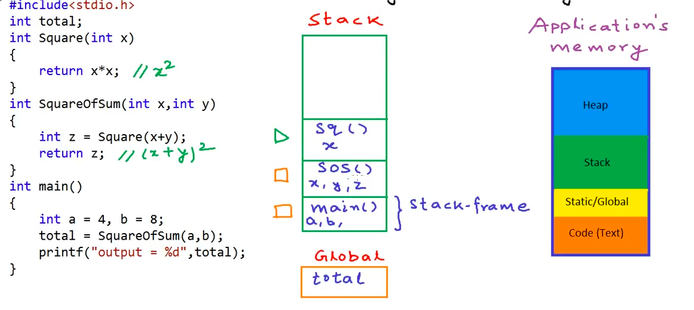

# 内存管理

- ### 内存中的五大区域

  - Stack 栈

    > Store all the information about function call executions, to store all the local variables

    > - 作用：存储局部变量(结构体变量存储于此)
    >
    > - 回收：当局部变量的作用域被执行完毕后，此局部变量就会被系统立即回收；
    >
    > - 特点：
    >   - 声明变量时，字节空间由高地址向低地址分配；
    >   - 空间相对较小，但访问效率较高

  - Heap 堆 / Free Store

    > We can request memory from the heap during runtime, and that's what we do when we use malloc or new operator.
    >
    > Fixed in size decided at compile time, which means they don't grow while the application is running.

    > - 作用：存储OC类对象，程序员手动申请(calloc, malloc等函数)
    > - 回收：MRC下 手动回收, ARC 下自动回收
    > - 特点：
    >   - 每次申请的字节地址都是从0开始，且每次地址不一定挨着，但每次申请的指定字节空间是挨在一起的、连续的
    >   - 空间相对较大，但访问效率相对栈较低

  - BSS 段

    > - 作用：存储未初始化的全局变量、静态变量
    > - 回收：一旦初始化，转存至数据段

  - Static / Global 数据段 / 常量区

    > Store the global variables that live for the entire lifetime of the program of the application.

    > - 作用：存储已经初始化的全局变量、静态变量和常量数据
    > - 回收：直到程序结束才被回收
    > - 特点：以字符指针形式存在常量区的字符串数据不能改

  - Code(Text) 代码段

    > Store all the instructions needs to be executed;

    > - 作用：存储代码(C语言的函数、结构体类型声明代码、OC类代码[以Class对象形式存储])
    > - 回收：程序结束回收

- ### C 程序中使用 堆内存

  > C functions to use heap memory

  - malloc

    > returns a void pointer that gives us the address of the first byte in this block, the block of memory that is allocates. So, using malloc you kind of say that hey, give me a block of with these many bytes.

  - calloc

    > advance malloc. initial to 0

  - realloc

    > change the size of the block of the memory.

  - free

- ### 程序运行过程中 栈内存 的变化

  > At any time during the execution of the program, the function at the top of the stack is executing and rest is kind of paused waiting for the function above to return something and then is will resume execution. 

  

- 堆内存 和 栈内存 的区别和各自的作用？

  > If the allocation of variables and functions in stack exceeds 1MB(assumption), our program will crash. Further the allocation and deallocation of memory onto the stack happens by a set rule, when a function is called, it is pushed onto the stack on top of the stack, when it is finished, it is popped and removed from the stack. It is not possible to manipulate the scope of a variable if it is on the stack.
  >
  > Another limitation is that, if we want to declare a large data type like an array as local valuable, we need to know the size of the array at compile time only. If we have a scenario like we have to decide how large the array will be based on some parameter during runtime then it is a problem with stack.
  >
  > 
  >
  > For all these problems, like allocating large chunks of memory or keeping variable in the memory till the time we want, we have heap.
  >
  > Heap is also called dynamic memory and using the heap is referred to as dynamic memory allocation.
  >
  > So, as you see, in terms of the scope of the variable, anything allocated on the heap is not automatically deallocated when the function completes like on the stack. And, it does not need to live for the whole life time of the application like a global valuable. We can control when to free anything on the heap, when to deallocate anything on the heap.