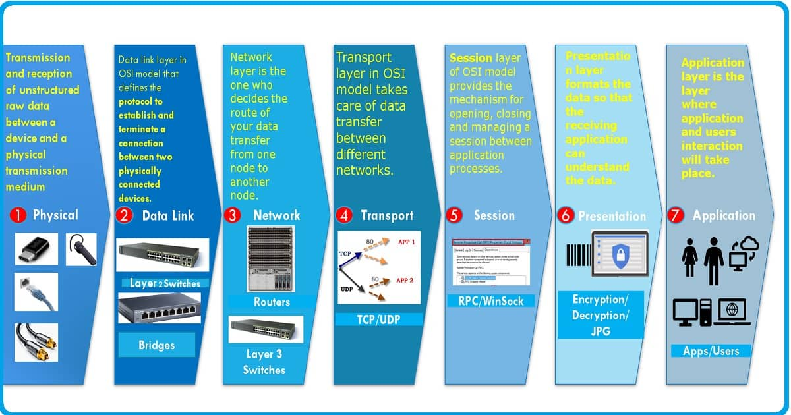
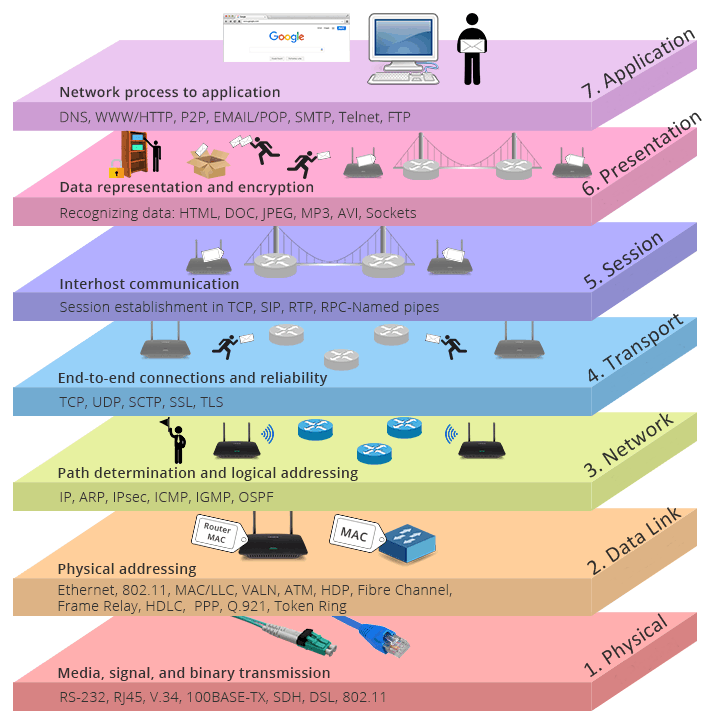

# 网络通信

> 详见 【网络新闻 App】、【网络通信】

- ### 网络的实际用途

  - 登录验证

    > 验证服务器上的用户名和密码，登录
    >
    > 发送HTTP请求，使用GET方法，将用户名和密码拼在url中
    > 发送HTTP请求，使用POST方法，将用户名和密码拼在请求体中

  - 获取 data

    > 二进制数据 (html, json, plist, xml等)

  - 上传文件

    > 上传图片、视频等
    >
    > 发送HTTP请求，使用POST方法，将要上传的文件拼在请求体中，需要服务器端php文件支持
    > 发送HTTP请求，通过session，使用PUT方法，不需要php支持，需要配置服务器webDav服务
    >
    > - 上传单个文件
    > - 上传多个文件
    > - 暂停
    > - 继续
    > - 取消
    > - 断点续传
    > - 进度显示

  - 下载文件

    > 下载图片、视频等

- 概念

  > - 客户端: 应用 C/S(Client/Server ) B/S(Browser/Server)
  > - 服务器: 为客户端提供服务、数据、资源的机器
  >   - 局域网服务器
  >   - 外网服务器
  >   - 本地测试服务器
  >   - 服务器软件
  >     - Apache
  >     - Nginx
  > - 请求：客户端向服务器索取数据
  > - 响应：服务器对客户端的请求做出反应，一般是返回给客户端数据

### 网络通信的过程 - 理论

> 【理论】网络通信的过程
>
> 网络模型 OSI 和 TCP/IP

- 存在的意义

  > 数据传输时，数据流流经的每一段，也就是数据从网络一端传到另一端要经过的步骤

- 数据传输的流程

  > Joya微信打字发送hello到YL手机的微信
  >
  > 微信(应用层)给这段字加上http协议的字段->传输层给这段字加上加上微信的端口信息【TCP(UDP)协议的字段】->网络层给这段字加上Joya手机的IP地址信息[IP协议的字段等]->网络接入层再添加一些信息?就进入网线传递了->到YL所在的网络中后经过相反的拆信息的步骤显示在YL手机的微信上。

- OSI模型(**O**pen **S**ystem **I**nterconnection Model)

  > 1. Application Layer 应用层
  >
  > 2. Presentation Layer 表示层
  >
  > 3. Session Layer 会话层
  >
  > 4. Transport Layer 传输层
  >
  >    > 四层交换机、四层路由器
  >
  > 5. Network Layer 网络层
  >
  >    > 路由器、三层交换机
  >
  > 6. Datalink Layer 数据连接层 
  >
  >    > 网桥、以太网交换机、网卡
  >
  > 7. Physical Layer 物理层 
  >
  >    > 中继器、集线器、双绞线

- TCP/IP 模型

  > - 应用层:
  >
  >   对应OSI的前三层，为用户提供所需的服务如FTP, Telnet, DNS,SMTP,HTTP等。浏览器应用对应http协议，文件传输软件对应ftp协议等。
  >
  > - 传输层: 
  >
  >   负责为要发送的数据加入始发程序的端口号或者按照接收到的数据的端口号在主机上寻找对应的指定的应用程序 
  >
  >   为应用层提供**端到端**的通信功能，保证了数据包的传输顺序及数据完整性。
  >
  >   端到端，即端口到端口，也就是一个主机上的应用到另一个主机上的应用
  >
  >   - 两个主要传输协议：TCP和UDP
  >
  >     - TCP(传输控制协议)
  >
  >       > 可靠的、通过“三次握手”来连接的数据传输服务，一对一
  >
  >     - UDP(用户数据报协议)
  >
  >       > 不保证可靠、无连接的数据传输服务，广播
  >
  > - 网络层
  >
  >   负责为要发送的数据加入自己主机的和要发送到的主机的IP地址信息，或者接收网络上属于自己主机IP地址的信息数据
  >
  >   解决主机到主机的通信问题。它所保护的协议涉及数据包在整个网络上的逻辑传输。注重重新赋予主机一个IP地址来完成对主机的寻址，它还负责数据包在多种网络中的路由。
  >
  >   该层有3个主要协议：IP网际协议、互联网组管理协议(IGMP)和互联网控制报文协议(ICMP)。
  >
  > - 网络接入层
  >
  >   （网卡层面）对应数据链路层和物理层 
  >
  >   负责监视数据在主机和网络之间的交换



### 网络通信的过程 - 实践

> Socket 通信

- 介绍

  > 位于应用层和传输层之间，应用程序构造数据，用户输入hello，应用层的软件把数据传给socket，socket把数据封装传输给传输层、网络层等。
  >
  > Socket又称”套接字“，应用程序通过”套接字“向网络发送请求或向网络做出应答
  >
  > 网络通信其实就是Socket之间的通信
  >
  > 数据在两个Socket之间通过IO传输数据
  >
  > Socket是纯C语言的，是跨平台的
  >
  > HTTP协议时基于Socket的，HTTP协议的底层使用的就是Socket

- 作用

  > 从这里开始传输数据，socket封装应用层App传入的用户要发送的数据，再将其传输给传输层、网络层直到网络通信的另一端(服务器)

- 通信过程

  > 1. 创建Socket
  > 	使用Socket()函数
  > 2. 连接到服务器
  > 	使用connect()函数
  > 3. 发送数据给服务器
  > 	使用send()函数
  > 4. 从服务器接收数据
  > 	使用recv()函数
  > 5. 关闭连接
  > 	使用close()函数

### 遵守 HTTP 协议的网络通信

- ### 请求 request

  > 向服务器发送的数据
  >
  > 请求头、请求体

  - HTTP 请求 

    > HTTP Request，即要发送给服务器的数据，遵守HTTP协议固定格式的数据

  - HTTP 请求方法

    - GET

      > GET一般是获取服务器上的数据，可向服务器传递少量数据
      >
      > - 优点
      >
      >   - GET速度相对较快
      >
      >   - GET方式是通过URL传递数据，效率高
      >
      > - 缺点
      >   - 请求的数据在URL上，相对不安全
      >
      >     > login.php?username=zs&pwd=123456
      >
      >   - GET请求的结果能够被浏览器缓存
      >
      > - URL 中的参数
    >
      >   > a. login.php负责处理登录过程的服务器脚本
    >   >
      >   > b. ?后面跟要传到服务器上的参数(http协议的一部分)
      >   >
      >   > c. 参数以 键=值 的形式传递
      >   >
      >   > d. 如果有多个参数使用&连接
      >   >
      >   > http://127.0.0.1/php/login.php?username=admin&password=123
      >   >
      >   > e. 参数中如果有中文和空格创建URL会失败, 需要使用%转义，进行URL编码
      >   >
      >   > ```swift
      >   > // 获取网络服务器上JSON数据
      >   >     NSString *username = @"张三";
      >   >     NSString *password = @"zhan";
      >   >     NSString *urlString = [NSString stringWithFormat:@"http://127.0.0.1/php/login.php?username=%@&password=%@",username, password];
      >   >     // 如果url字符串中有汉字或空格，要对url字符串中?后面的空格或者汉字做百分号转义
      >   >     urlString = [urlString stringByAddingPercentEncodingWithAllowedCharacters:[NSCharacterSet URLQueryAllowedCharacterSet]];
      >   >     NSURL *url = [NSURL URLWithString:urlString];
      >   > ```
    >   >
      >   > 

    - POST
    
      > POST速度相对GET较慢
    >
      > 传递大量数据时使用，比如上传文件使用post
    >
      > POST一般是往服务器提交数据，并获取服务器返回的结果
      >
      > POST方式是通过请求体传输数据，效率低
      >
      > POST请求的数据用户看不到，并且不能被浏览器缓存相对安全，传递隐私数据时使用
      >
      > - POST请求头比GET请求头中多的东西
    >
      >   Content-Length: 25 // 发送给服务器数据的大小
    >
      >   Cache-Control: max-age=0 // 永不缓存数据
    >
      >   Content-Type: application/x-www-form-urlencoded // 请求头中的Content-Type
    >
      >   // 告诉服务器，发给服务器的数据格式和url中传参的格式是一样的 key=value&k1=v1

    - HEAD
    
      > 不获取响应体，只获取响应头
      >
      > 一般在下载之前先获取文件的大小
    
    - PUT
    
      > PUT 上传
      >
      > 配置Apache服务器WebDav功能
      >
      > put直接以文件的方式写入
      >
      > post需要服务器端脚本支持
    
    - DELETE
    
    - OPTIONS
    
    - TRACE
    
    - CONNECT
    
    - PATCH
    
  - 请求体中各项的含义

    > - 请求体:
    >
    >   > ------WebKitFormBoundaryqwY1zO88PZll2khX
    >   >
    >   > Content-Disposition: form-data; name="userfile"; filename="pic03.jpg"
    >   >
    >   > Content-Type: image/jpeg
    >   >
    >   > 
    >   >
    >   > 二进制数据(要上传的文件)
    >   >
    >   > ------WebKitFormBoundaryqwY1zO88PZll2khX--
    >
    > - 含义:
    >
    >   > 分隔符 ------WebKitFormBoundaryqwY1zO88PZll2khX
    >   >
    >   > name 表单的name属性值
    >   >
    >   > filename 传递给服务器的文件名
    >   >
    >   > Content-Type 告诉服务器传递的文件类型
    >   >
    >   > text/plain image/jpeg image/jpg image/png application/octet-stream等
    >   >
    >   > 二进制数据 要上传文件的NSData

- ### 响应 response

  > 即服务器返回的数据

  - HTTP 响应

    > - HTTP Response 即从服务器接收的数据，遵守HTTP协议固定格式的数据
    >
    > - 响应的构成
    >   - 状态行Status Line 
    >   - 响应头Headers
    >   - 响应体Content

  - 状态码

    > 200 正常
    > 401 没有授权


- ### HTTPS

  - 发送请求之前先挑战服务器(进行https的协商)

  - https的协商

    > 1. 信任服务器返回的证书(公钥)
    > 2. 客户端产生随机秘钥
    > 3. 公钥对随机秘钥进行对称加密(rsa)
    > 4. 把公钥加密后的随机秘钥发送给服务器
    > 5. 使用随机秘钥加密数据和服务器交互

  ```objc
  // https的证书认证交换秘钥加密信息等，这个方法实现后，可正常接收https的网页信息
  - (void)URLSession:(NSURLSession *)session didReceiveChallenge:(NSURLAuthenticationChallenge *)challenge completionHandler:(void (^)(NSURLSessionAuthChallengeDisposition, NSURLCredential * _Nullable))completionHandler {
      NSLog(@"收到服务器挑战");
      
      // 判断认证方式(是用户名密码还是证书认证)
      if (challenge.protectionSpace.authenticationMethod == NSURLAuthenticationMethodServerTrust) {
          // 设置信任服务器的证书
          NSURLCredential *credential = [NSURLCredential credentialForTrust:challenge.protectionSpace.serverTrust];
          completionHandler(0,credential);
      }
  }
  ```

  

- ### Charles抓包监视HTTP请求和响应内容

- ### 压缩和解压

  > SSZipArchive【如果走完所有步骤还是无法解压，查看被加压的文件权限】

一台服务器的不同端口可以处理不同的网络请求

192.168.31.254 此地址的服务器可以处理以下不同的网络请求

- http://192.168.31.254:5000/

  此服务器上处于 5000 端口的程序处理遵守 http 协议的网络请求(发送的字符串数据是http协议格式)

- ftp://192.168.31.254:21/  

  21 端口的程序处理遵守ftp协议的网络请求(发送的字符串数据是按照ftp协议格式组织的)

- smb://192.168.31.254:445/

  445 端口的程序处理遵守smb协议的网络请求(发送的字符串数据是按照smb协议格式编制的)

- afp://192.168.31.254:548

  548 端口的程序处理符合afp协议的网络请求(发送的字符串数据是按照afp协议格式编制的)