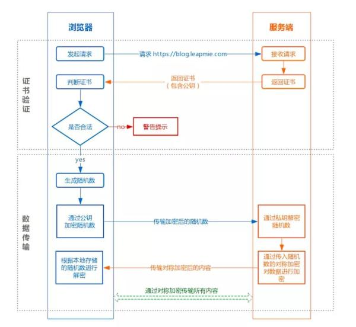

# HTTPS

## HTTPS介绍

> 结合 非对称 和 对称 两种加密算法保证网络数据的安全传输。
>
> HTTPS 主要由两部分组成：HTTP + SSL / TLS，也就是在 HTTP 上又加了一层处理加密信息的模块。服务端和客户端的信息传输都会通过 TLS 进行加密，所以传输的数据都是加密后的数据。

> [HTTPS原理看了很多，这个是最清晰的！](http://www.easemob.com/news/3706)
>
> [也许，这样理解HTTPS更容易](https://mp.weixin.qq.com/s/XD2ohvuqeOM4DcHw_NR1WA)

### HTTPS网络通信过程

> HTTPS 在内容传输的加密上使用的是对称加密，非对称加密只作用在证书验证阶段。
>
> HTTPS 的整体过程分为证书验证和数据传输阶段，具体的交互过程如下

> 客户端A; 服务器B; 

1. A向B发送网络请求；

2. B把自己的证书(包含自己的公钥)传递给A【网络传输: 无加密，这个证书可以给任何人，即B的公钥任何人都可以拿到，不影响什么】

3. A用自己装机就带的证书机构的公钥解密证书，拿到B的公钥【本地操作】

4. A用B的公钥将自己的AES随机数加密传送给B【网络传输: 非对称加密，只有B可以用自己的私钥解密，窃取到的人没有B的私钥无法解密】

5. 这样A和B都安全地拥有了A的AES随机数，它们之间用AES对称加密算法进行数据的安全传输

- ### 数字证书:

  > 就是CA用自己的私钥将B的公钥加密后的密文，只能用CA的公钥解密获取到B的公钥和有关B的其他信息。

- B为什么不直接把自己的公钥传递给A，而是把证书机构CA给它颁发的证书传给它?

  > 因为如果直接传递公钥的话，可能在半路被代理之类的中间人拦截替换掉，从而截取到通信内容。
  >
  > 而使用证书传递的话可以避免，因为A只会用证书机构的公钥来解密证书，被调包的证书无法用证书机构的公钥解开，这样确保了证书不会被掉包，从而确保了公钥不被掉包。

- ### 数字签名：

  > 一下仅为个人理解，很有可能是错的：
  >
  > 用CA的私钥加密后的证书，只能用CA自己的公钥才能解开。所以能用CA的公钥解开的证书，肯定都是CA颁发的。
  >
  > 因此，CA用自己的私钥为B的公钥加密，即制作证书的过程，也就是数字签名的过程？
  >
  > 而A在用CA的公钥解密一个证书的过程，也叫做验证数字签名？

怎样辨别同一机构下的不同证书? 

A拿到了一个CA颁发的证书，能用CA的公钥解开并获取到公钥，可A怎么知道这个公钥是B的还是某个中间人的呢？

A解开这个证书后，证书中会有这个公钥对应的一串编号(数字签名),这个编号也是用CA的私钥加密过的密文，需要用CA的公钥解密才能获取到， 一个编号对应着一个人，这下只要弄清这个编号对应的到底是B还是某个中间人就行了。

