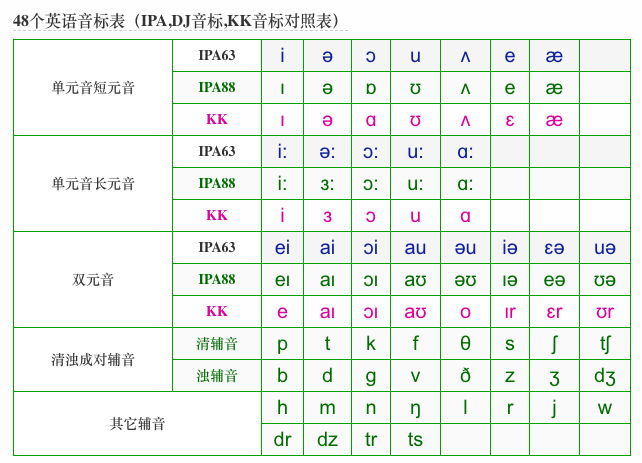
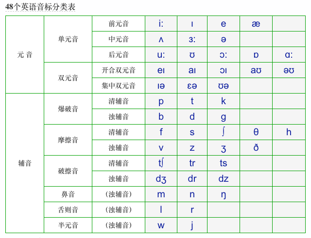
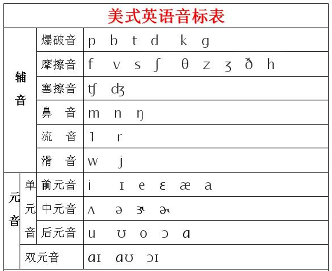
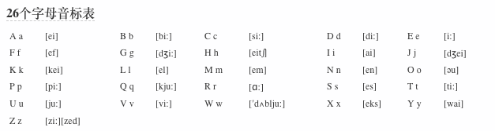
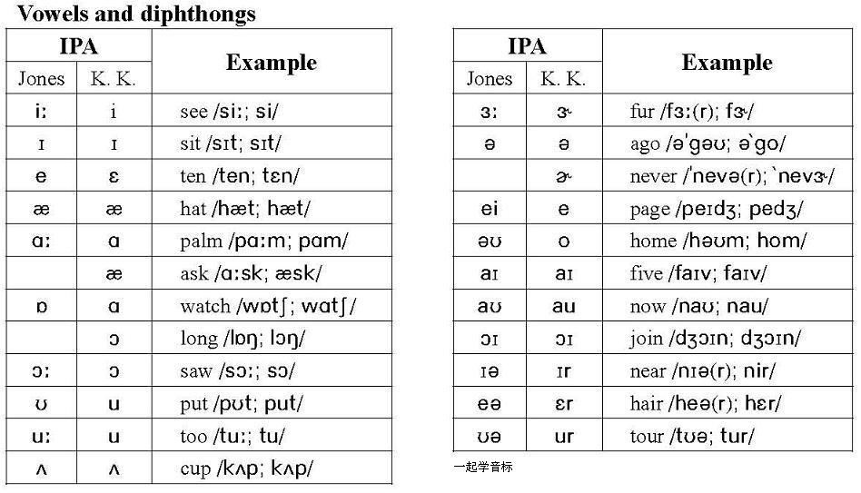

# 英语音标

## 48个英语音标分类表

> 元音20个，辅音28个

## 美式英语音标表

## 美式元音（18个）

单元音：/i/ /ɪ/ /e/ /ɛ/ /æ/ /a/ /ʌ/ /ə/ /ɚ/ /ɝ/ /o/ /ɑ/ /ɔ/ /ʊ/ /u/

双元音：/aɪ/ /aʊ/ /ɔɪ/

**注：**有的地方将/a/写作/ɑ/，有时习惯上也将单元音/o/的位置读成双元音/oʊ/，将单元音/e/的位置读成双元音/eɪ/。

## 英式元音（20个）

单元音：/i:/ /ɪ/ /e/ /æ/ /ɜ/ /ə/ /ʌ/ /ɔ:/ /ɒ/ /u:/ /ʊ/ /ɑ:/

双元音：/aɪ/ /eɪ/ /aʊ/ /əʊ/ /ɔɪ/ /ɪə/ /eə/ /ʊə/

**注：**美式音标中摈弃了英式音标中的长元音符号 /:/，这是英式与美式音标书写上的最大区别！

## 26个字母音标表

## 单元音和双元音

## 单元音短元音

- - /ɪ/ [/i/] - 额和诶之间 this hit fill ship sit bit 与/i/ \ /I:/互为短长音且易混
  - /ə/ - ago, ability, banana, idea
  - /ɑ/ [/ɒ/ /ɔ/ ] - doctor box chocolate 与 /ɔ/易混
  - /ʊ/ - book look foot cooking 与/u/ 互为短长音且易混
  - /ʌ/ - 啊和额之间 but love just
  - /ɛ/ [/e/] - 拜和别之间 bed pet let kept smell
  - /æ/ - cat happy bag black have happy sad and add attack

## 单元音长元音

- - /i/ \ /i:/- feel sheep seat beat 与/ɪ/ 互为长短音
  - /ɜ/ \ /ə:/
  - /ɔ/ [/ɔ:/] dog law
  - /u/ \ /u:/ school food tooth room 与/ʊ/ 互为长短音
  - /ɑ/ [/a:/] - father

## 双元音

- - /e/ [/eɪ/] - day may name
  - /aɪ/ - smile like skype night
  - /ɔɪ/ - boy oil coin
  - /aʊ/ - now cow down
  - /o/ \ /əʊ/
  - /Ir/ \ /ɪə/
  - /ɛə/ \ /eə/
  - /ʊr/ /ʊə/

## 清浊成对辅音

- - /p/
  - /b/
  - /t/
  - /d/
  - /k/
  - /g/
  - /f/
  - /v/ - very visitor video
  - /θ/
  - /ð/
  - /s/
  - /z/
  - /ʃ/ -上下唇翘起，万全露出上下牙
  - /ʒ/ - 上下唇翘起，万全露出上下牙 television usually pleasure 与/ʃ/互为清浊辅音
  - /tʃ/ - 上下唇翘起，万全露出上下牙 children cheese China choice
  - /dʒ/ - 上下唇翘起，万全露出上下牙 just

## 其他辅音

- - /h/
  - /m/ - million
  - /n/ - been sixteen thin 前鼻音
  - /ŋ/ - hang sing song 后鼻音
  - /l/ - milk will lake
  - /r/
  - /j/
  - /w/ - where
  - /dr/
  - /dz/
  - /tr/
  - /ts/

