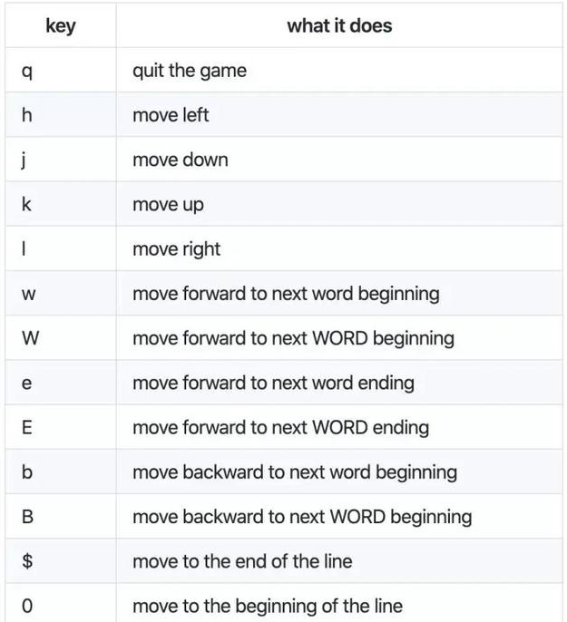

# Vim

- 三种模式

  - 一般模式

    光标移动：  h  j k l

    光标移到行首 0

    光标移到行尾 $

    u 表示undo，回退、撤销上一步操作

    ctrl+r 表示redo，恢复上一步被撤销的操作

    在非编辑状态下:set nu 会显示行号

    Ctrl + f  向下翻页

    ctrl + b 向前翻页

  - 编辑模式

  - 命令行模式

- 打开文件 `sudo vim httpd-dav.conf` 

- 搜索

  - `/`
  -  `:/`

  > 别管光标位置，直接输入命令行:/httpd-dav.conf （因为现在并非编辑状态，"/"代表搜索的意思），然后回车，光标自动跳到那个位置

- 进入编辑状态 `i`：

- 退出编辑状态 `esc`

- 退出

  > 必须按 Esc，处于非编辑状态后，输入下面的指令才会起作用

  - 保存并退出 `:wq`
  - 不保存退出 `:qa`
  - q

## pacvim 游戏

pacvim [LEVEL_NUMBER] [MODE]

上述代码中的 LEVELNumber 取值范围为 0 - 9，数字越大，难度越高。

Mode 可选 N 或 H，N 表示 Normal ，正常难度；H 则表示 Hard ，困难。

pacvim 8 n

