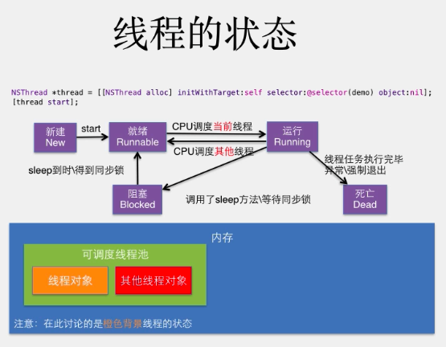

# NSThread

- ### 简介

  > OC语言
  >
  > 使用更加面向对象
  >
  > 简单易用，可直接操作线程对象
  >
  > 线程生命周期程序员管理

- ### 线程的状态

  - 新建
  - 就绪
  - 运行
  - 阻塞
  - 死亡

  

- ### 线程的属性和方法

  > - 线程名称name
  >
  >   > 设置线程名称可以当线程执行的方法内部出现异常的时候，记录异常和当前线程
  >
  > - 线程优先级threadPriority
  >
  >   > 线程的优先级，并不能保证谁先执行完
  >   >
  >   > 内核调度算法在决定该运行哪个线程时，会把线程的优先级作为考量因素，较高优先级的线程会比较低优先级的线程具有更多的运行机会。较高优先级不保证你的线程具体执行时间，只是相比较低优先级的线程，它更有可能被调度器选择执行而已。
  >
  > - isMainThread

- ### 使用方法

  ```objc
  // 线程状态之 - 创建
  
  NSThread *thr = [[NSThread alloc] initWithTarget:self selector:@selector(demo) object:nil];
  
  // 线程状态之 - 就绪(进入可调度线程池，CPU会来给它几毫秒的执行时间)
  [thr start];
  ```

  

