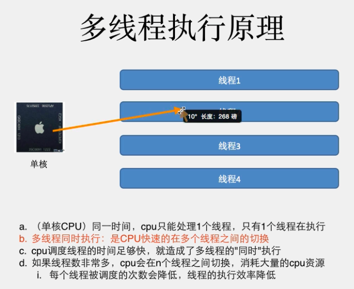
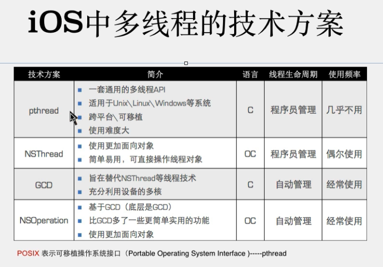

# 多线程

- ### 存在的意义

  > 在主线程(UI线程)上执行耗时任务会造成卡顿，比如网络通信、循环等
  >
  > 屏幕两个控件接收用户点击，一个控件点击后会执行耗时操作，这时再点击另外一个就不起作用，界面卡死了(阻塞)。
  >
  > 解决办法：将耗时操作放到另外一个线程去执行

- ### 概念

  - 进程 Process

    > 指在系统中正在运行的一个应用程序
    >
    > 每个进程之间是独立的，每个进程均运行在其专用的受保护的内存空间内
    >
    > 通过"活动监视器"可以插卡Mac系统中所开启的进程

  - 线程 Thread

    > 1个进程由多个线程组成(1个进程只要要有1个线程)
    >
    > 线程是进程的基本执行单元，一个进程的所有任务都在线程中执行

    - 主线程

      > 一个程序运行后，默认会开启一个线程，成为”主线程“或”UI线程“，一般用来刷新UI界面，处理UI事件(比如：点击、滚动、拖拽等事件)
      >
      > 主线程的runloop默认开启，保证程序不退出

    - 子线程

      > 除了主线程都是子线程，子线程的runloop默认不开启

  - 多线程 Multi - Thread

    > 一个进程可以开启多个线程，多个线程可以”同时“执行不同的任务
    >
    > 多线程可以解决程序阻塞的问题
    >
    > 多线程可以提高程序的执行效率

  - 队列 Queue

    > 将一些耗时的任务全部添加到队列中，CPU从队列中取出任务执行
    >
    > GCD会自动将队列中的任务取出，放到对应的线程中执行
    >
    > 任务取出遵循FIFO原则：First in First out.
    >
    > - 串行队列 Serial Queue
    >
    >   > 这种队列中的任务一个一个的按顺序执行
    >
    > - 并行队列 Concurrent Queue
    >
    >   > 这种队列中的任务可以好几个同时开始执行

  - 同步 sync

    > CPU执行当前线程的代码时，遇到Sync会等待，Sync后的代码块执行完毕再执行下段代码
    
  - 异步 async

    > CPU执行当前线程的代码时，遇到Async会直接跳过其中的代码块直接执行下段代码【此段代码另开线程执行去了】

  

- ### 多线程原理

  > CPU快速在多个线程之间切换执行
  >
  > CPU调度线程的时间足够快，就造成了多线程的“同时”执行
  >
  > 线程执行完毕会自动销毁

  

- ### 多线程优缺点

  - 优点

    > 能适当提高程序的执行效率
    >
    > 能适当提高资源的利用率(cpu, 内存)
    >
    > 线程上的任务执行完成后，线程会自动销毁

  - 缺点

    > 开启线程需要占用一定的内存空间(默认情况下，每一个线程都占512KB)
    >
    > 如果开启大量的线程，会占用大量的内存空间，降低程序的性能
    >
    > 线程越多，cpu在调用线程上的开销就越大
    >
    > 程序设计更加复杂，比如线程间的通信、多线程的数据共享

- ### iOS 中多线程方案

  

- ### 线程间通信

  > 从子线程回到主线程
  >
  > 比如: 当图片在子线程上异步下载完成后回归到主线程上更新UI

- ### 多线程访问共享资源的问题【线程安全】

  - 共享资源

    > 1块资源可能会被多个线程共享，也就是多个线程可能访问同一资源
    >
    > 比如多线程访问同一个对象、同一个变量、同一个文件

  - 问题

    > 当多个线程访问同一资源时，很容易引发数据错乱和数据安全问题

  - 互斥锁

    > 线程同步：一个线程一个线程的执行
    >
    > - 使用
    >
    >   > @synchronized(锁对象) {需要锁定的代码(有对共享变量或文件的读写操作)}
    >
    > - 特点
    >
    >   > 能有效防止因多线程抢夺资源造成的数据安全(正确)问题
    >   >
    >   > 但会影响程序的执行效率，因为在锁住的时候，其他线程在等待，削弱了多线程的作用，所以这个锁锁的代码越少越好
    >
    > - 原理
    >
    >   > 每一个对象(NSObject)内部都有一个锁(变量)，当有线程要进入synchronized到代码块中会先检查对象的锁是打开还是关闭状态，如果锁是打开状态(1), 如果是线程执行到代码块内部 会先上锁(0)。 如果锁被关闭，再有线程要执行代码块就先等待，直到锁打开才可以进入。
    >   >
    >   > 
    >   >
    >   > 线程执行到synchronized
    >   >
    >   > i 检查上锁状态 如果是开锁状态(1)转到ii 如果上锁(0)转到v
    >   >
    >   > ii 上锁(0)
    >   >
    >   > iii 执行代码块
    >   >
    >   > iv 执行完毕 开锁(1)
    >   >
    >   > v 线程等待(就绪状态)
    >   >
    >   > 
    >   >
    >   > 加锁后程序执行的效率比不加锁的时候要低，因为线程要等待锁，但是锁保证了多个线程同时操作全局变量的安全性

  - 自旋锁

    > 原子属性
    >
    > - 属性的修饰符
    >
    >   nonatomic 非原子属性
    >
    >   atomic 
    >
    >   > 原子属性(线程安全)，针对多线程设计的，默认值
    >   >
    >   > 保证同一时间只有一个线程能够写入(但是同一个时间多个线程都可以取值)
    >   >
    >   > atomic 本身就有一把锁(自旋锁)
    >
    > - nonatomic和atomic对比
    >
    >   > atomic：线程安全，需要消耗大量的资源
    >   >
    >   > nonatomic：非线程安全，适合内存小的移动设备
    >
    > - iOS开发建议
    >
    >   > 所有属性都声明为nonatomic
    >   >
    >   > 尽量避免多线程抢夺同一资源
    >   >
    >   > 尽量将加锁、资源抢夺的业务逻辑交给服务器端处理，减小移动客户端的压力
    >
    > - 自旋锁无法解决卖票的问题，因为读写还是分开的

  - 互斥锁和自旋锁的区别

    - 互斥锁

      > 如果发现其他线程正在执行锁定代码，线程会进入休眠(就绪状态)，等其他线程时间片到打开锁后，线程会被唤醒(执行)

    - 自旋锁

      > 如果发现有其他线程正在锁定代码，线程会用死循环的方式，一直等待锁定的代码执行完成，自旋锁更适合执行不耗时的代码

  - 线程安全

    > 线程同时操作是不安全的，多个线程同时操作一个全局变量
    >
    > 线程安全：在多个线程进行读写操作时，仍然能够保证数据的正确

  - 主线程(UI线程)保证线程安全

    > 几乎所有UIKit提供的类都是线程不安全的，所有更新UI的操作都在主线程上执行
    >
    > 所有包含Mutable的类都是线程不安全的

    

- ### 多线程和网络通信的关系

  > 多线程是为了减少卡顿，而卡顿是由于在主线程上执行了耗时任务造成的，将耗时任务另外开子线程线程去执行就会减少卡顿，而网络通信就是耗时任务，所以，在网络通信任务一般都会开子线程执行。