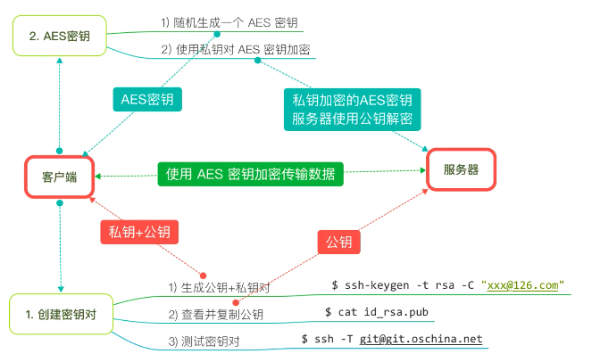

# SSH Key登录

> Secure Shell 安全外壳协议

- ### 公钥和私钥的特点

  > 使用私钥加密的密文，所有公钥都可以解密
  >
  > 使用公钥加密的密文，只有私钥可以解密

- ### 使用SSH登录进行通信的流程

  1. 在客户端生成一对秘钥对，私钥自己留着，公钥交给服务器。
  2. 在客户端生成一个 AES 秘钥(相当于一个随机数?)，用秘钥加密后，通过网络传递给服务器。
  3. 服务器用公钥解密，拿到 AES 秘钥。
  4. 这样客户端和服务器都安全地拥有了这个 AES 秘钥，从此用 AES 对称加密进行网络通信。



- ### 使用方法

  1. 使用 RSA 非对称算法，生成 `密钥对`，自己留着 `私钥` (用来解密信息)

     ```
     ssh-keygen -t rsa -C root
     ```

     > 默认密钥对存放的位置
     >
     > /Users/joyawang/.ssh/instance1.pub
     >
     > /Users/joyawang/.ssh/instance1

  2. 将 `公钥` 传递给服务器端(用来加密信息)，或直接去服务器页面手动设置

  3. 登录

     > 第一种方式: ssh 用户名@主机地址
     >
     > 比如: ssh root@192.168.38.1
     
     > 第二种方式: Terminal - Shell - NewRemoteConnection 在 Server 框点击＋