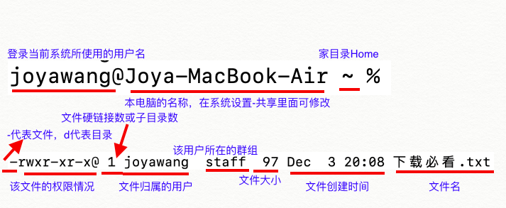
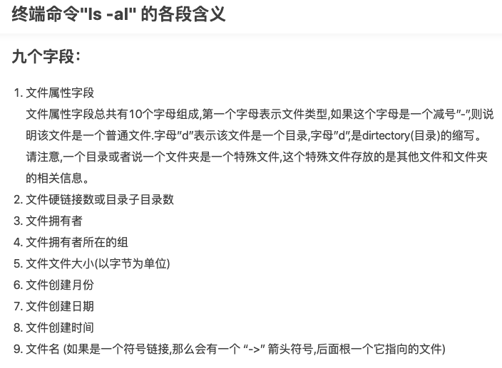

# 终端命令 Unix / Linux Command

提权 `sudo` super user do


光标移到行首 control + a

光标移到行尾 control + e

netstat -aptn命令行，查看所有开启的端口号

lsof -i:端口号命令行，以80为例


查看程序的pid等信息 `ps -ef | grep trojan`

> 出现 501 81262 79513  0 4:40PM ttys000  0:00.01 grep trojan

> `-e` and `-f` are options to the `ps` command, and pipes take the output of one command and pass it as the input to another. Here is a full breakdown of this command:
>
> - `ps` - list processes
> - `-e` - show all processes, not just those belonging to the user
> - `-f` - show processes in full format (more detailed than default)
> - `command 1 | command 2` - pass output of command 1 as input to command 2
> - `grep` find lines containing a pattern. grep (global search regular expression(RE) and print out the line,全面搜索正则bai表达式du并把行打zhi印出来)是一种强大的文本dao搜索工具，它能使用正则表达式搜索文本，并把匹配的行打印出来。
> - `processname` - the pattern for `grep` to search for in the output of `ps -ef`
>
> So altogether
>
> ```
> ps -ef | grep processname
> ```
>
> means: look for lines containing `processname` in a detailed overview/snapshot of all current processes, and display those lines

关闭/杀死程序 `kill -9 79513`

开启程序 


切换用户 su joyawangchina

设置密码 passwd joyawangchina

**cat /proc/cpuinfo **查看linux系统的CPU型号、类型以及大小

**cat /proc/meminfo** 查看linux系统内存大小的详细信息，可以查看总内存，剩余内存、可使用内存等信息

1、从服务器下载文件
 scp username@servername:/path/filename /tmp/local_destination
 例如scp codinglog@192.168.0.101:/home/kimi/test.txt 把192.168.0.101上的/home/kimi/test.txt
 的文件下载到 /tmp/local_destination
  2、上传本地文件到服务器
 scp /path/local_filename username@servername:/path  
 例如scp /var/www/test.php codinglog@192.168.0.101:/var/www/ 把本机/var/www/目录下的test.php文件
 上传到192.168.0.101这台服务器上的/var/www/目录中

 3、从服务器下载整个目录
   scp -r username@servername:remote_dir/ /tmp/local_dir 
  例如:scp -r codinglog@192.168.0.101 /home/kimi/test  /tmp/local_dir

 4、上传目录到服务器
   scp -r /tmp/local_dir username@servername:remote_dir
   例如：
   scp -r test   codinglog@192.168.0.101:/var/www/  把当前目录下的test目录上传到服务器

   的/var/www/ 目录


### 编辑

- 终端 `control + u` 删除一行命令

### 终止、退出

- 暂停终端当前运行的进程 `Control z`
- 强制退出终端 `Command q`
- 强制退出系统当前运行的某程序 `killall WeChat`

- 退出 man 手册 `q`

- 终止终端当前运行的进程 `Control c` cancel the running process

### 查看IP

- 查看 IP 地址 `ifconfig` en0 wifi地址; en1 ethernet

- 查看局域网所有设备 `arp -a`

- 查看本机与某 IP 地址的机器是否连通 `ping`

- 查看本机到目的地 IP 之间经过多少路由器 `traceroute www.baidu.com`


### 清屏

-  `Control l(L)` `Command k`

语音朗读 `say hi`

反射、重复、回声: `echo "求知若渴，虚心若愚"`


## 目录/文件夹

### 目录快捷键

- 根目录 `/` root directory

- 当前工作目录 `.`


- 当前工作目录的根目录 `./`  比如 `./a.out` 就是当前文件夹中的 a.out 文件


- 家目录、当前用户的根目录 `~`

- 家目录的根目录 `~/`

### 查看目录和切换目录

- 查看当前在哪个目录 `pwd` print working directory


- 切换到某个目录`cd /Users/joyawang/Desktop`

- 切换到上一级文件夹 `cd ..`

- 切换到家目录 `cd`

- 切换到根目录 `cd /`


### 查看目录下的文件和文件夹

- 查看当前文件夹下所有文件和文件夹 `ls` List
- 查看当前文件夹下所有文件和文件夹(包含隐藏文件) `ls -a`

- 查看(详细)当前文件夹下所有文件和文件夹以及权限 `ls -l`

- 查看(详细)当前文件夹下所有文件和文件夹(包含隐藏文件)以及权限 `ls -al`


### 新建、删除、复制文件夹和文件

- 新建文件夹(在当前目录) `mkdir newdirectoryname`
- 删除空文件夹 `rmdir directoryname`
- 删除文件夹(非空也可以) `rm -rf directoryname`
- 新建文件 `touch`
- 删除文件 `rm a.txt`
- 复制文件 `cp ~/Desktop/MyFile.rtf ~/Documents`
- 复制文件 `cp -R froshims0 froshims1 `  within same working directory, copy froshims0 directory **and** paste **and** rename to froshims1 within same directory
- 复制文件夹及其中所有内容 `cp -R ~/Desktop/MyFolder /Documents` 


查看文件内容 `cat a.txt`

查看文件内容(分页) `more a.txt` (f,b) Forward下 一页和backword上一页

比较两个文件  `diff` Compares two files line by line (assumes text).

## 文件权限查看、更改






- ### 查看文件权限

  `ls -l 文件或文件夹名`

  - 实例

    > 查看test.h文件的权限信息`ls -l ./Desktop/test.sh`

- ### 更改文件权限 `chmod` 

  > change file modes or Access Control Lists

  - 实例

    > 给test.h文件添加可执行权限 `chmod +x ./Desktop/test.sh` 
    
  - 语法：chmod abc file
     引用地址:[https://blog.csdn.net/my_wade/article/details/47066905](https://links.jianshu.com/go?to=https%3A%2F%2Fblog.csdn.net%2Fmy_wade%2Farticle%2Fdetails%2F47066905)
     其中a,b,c各为一个数字，a表示User，b表示Group，c表示Other的权限。
  
    r=4，w=2，x=1
  
    若要rwx（可读、可写、可执行）属性，则4+2+1=7
  
    若要rw-（可读、可写、不可执行）属性，则4+2=6
  
    若要r-w（可读、不可写、可执行）属性，则4+1=5
     范例：
  
    chmod a=rwx file 和 chmod 777 file 效果相同
  
    chmod ug=rwx,o=x file 和 chmod 771 file 效果相同
  
    若用chmod 4755 filename可使此程式具有root的权限


- ### 更改文件 所有者 和 所有组 `chown` 

  > change file owner and group

  - 实例

    - `sudo chown -R acme:acme /usr/local/etc/certfiles`

      > - `chown` 更改文件的所有者
      > - `-R ` 处理指定目录以及其子目录下的所有文件
      > - `acme` 新的文件所有者ID
      > - `:acme` 新的文件所有者的所属组(group)
      > - `/usr/local/etc/certfiles` 要更改的文件

    

- ### 更改文件 属组 `chgrp`

  > change group


## 创建用户组、用户

- 创建用户组 sudo groupadd certusers

  certusers

  - 申请到证书后将证书所有权交给此用户组
  - 允许此组内用户访问证书

- 创建用户  
  - trojan `sudo useradd -r -M -G certusers trojan`
    - `-r` 系统用户 
    - `-M` 无需登录 
    - 无需家目录
    - `-G certusers` 加入群组
  - acme `sudo useradd -r -m -G certusers acme`
    - `-r`  系统用户
    - `-m` 需要家目录
    - 未设置密码，不能登录，只能通过其他已经登录的用户切换过去
    - 需要读写证书文件，添加到用户组 certusers `-G certusers`

    - `-g<群组> 　指定用户所属的群组`。

    - `-G<群组> 　指定用户所属的附加群组。`

    - `-m 　自动建立用户的登入目录。`

    - `-M 　不要自动建立用户的登入目录。`

    - `-n 　取消建立以用户名称为名的群组．`

    - `-r 　建立系统帐号。`

  

在终端运行的程序

Git, Cocoa Pods, Trojan, Nginx, apache, Home brew, Vim


