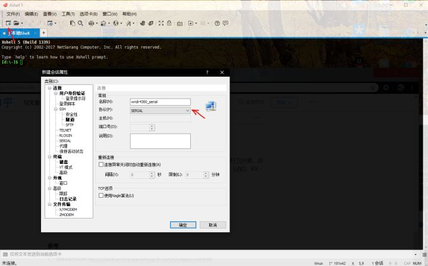

# WNDR4300刷机

> 参考链接:
>
> https://zhuanlan.zhihu.com/p/76589656
>
> https://www.zhihu.com/question/38537840
>
> https://www.right.com.cn/forum/thread-2117545-4-1.html
>
> 刷机文件:
>
> http://gofile.me/4izOQ/PNIVuji5K

### 1. 通过TTL转USB线连接路由器和电脑

> USB 转 TTL 的模块，型号名曰 CH340，或CH340G，到时候要装驱动就直接百度搜CH340G驱动

左下角的四个针脚就是TTL针脚，**自下而上**分别为 GND、RX、TX、VCC 。路由器与转接模块的连接方式为 GND - GND、RX - TXD、TX - RXD、VCC **不接**。连接电脑安装TTL线的驱动后，路由器就是连接在电脑com3串口(串行通讯端口)的设备了。


### 2. 通过Xshell连接控制com3端口的路由器

在Xshell中，通过建立serial连接，连接到com3或4

设置登录脚本，等待字符串 "Hit any key to stop autoboot" ，发送"?" （发送任意字符都可以）

设置端口（port）为设备管理器中显示的 COM 端口名，一般为 COM3 。设置波特率（Baud Rate）为 115200 【如果乱码，换成117200】，数据位为8，停止位为1，校验位为 None，流控为 None 。确定，连接。

接通路由器电源，按下开关，如果出现下图中的显示，那就成功一半了。

开启路由器，Xshell中就会打印信息

因为路由器在循环重启，无法在Xshell中输入命令，所以通过创建执行脚本，可以让路由器在Auto boot的地方停下来。


### 3. 进入TFTP恢复模式

输入fw_recovery, 这时路由器就成为了TFTP服务器，ip地址为192.168.1.1，在69端口等待接收要刷入的系统。


### 4. 将电脑设置为和路由器在同一网段

断开电脑其他的网络，从路由器的lan口连接网线到电脑，这时电脑会连到路由器的网络，所以可以手动配置IP地址，要配置到跟路由器在同一个网段，也就是192.168.1.x，这样后面才能通过TFTP协议将要刷入的系统传入路由器。


### 5. TFTP刷机

这时就可以通过各种办法从TFTP客户端将要刷入的系统传入路由器了。

#### 在Windows上可以通过TFTP客户端，也可以如下通过cmd命令行

> 此处下载固件：[Index of /chaos_calmer/15.05/ar71xx/nand/](https://link.zhihu.com/?target=https%3A//downloads.openwrt.org/chaos_calmer/15.05/ar71xx/nand/)
> 文件名：openwrt-15.05-ar71xx-nand-wndr4300-ubi-factory.img
>
> 推荐直接 tftp 刷机：
> 1.电脑设置静态 IP：
> IP：192.168.1.2
> 子网掩码：255.255.255.0
> 默认网关：192.168.1.1
>
> 2.将电脑连接至路由器任一 LAN 口
>
> 3.在 Windows 控制面板 -> 程序 -> 启用或关闭Windows功能 中，开启 TFTP 客户端
>
> 4.关闭路由器电源，使用牙签(或其他类似物)捅住路由器背面的 reset 按钮不放，打开路由器电源，待电源指示灯呈绿色并有规律闪动即可松开 reset 按钮
>
> 5.传送固件，打开命令行窗口，使用 
>
> ```text
> tftp -i 192.168.1.1 put <路径>/openwrt-15.05-ar71xx-nand-wndr4300-ubi-factory.img
> ```
>
>  传送固件至路由器，出现如下提示则固件传送成功：
>
> ```text
> 传输成功: 3 秒 12451969 字节，4150656 字节/秒
> ```
>
> 
>
> 6.静待路由器重启并完成固件刷新，切不可着急强制切断电源
>
> 7.待确认路由器重启成功后(比如可以登录[http://192.168.1.1](https://link.zhihu.com/?target=http%3A//192.168.1.1))，直接关闭路由器电源然后再打开电源，否则可能出现 5G WiFi 不可用的问题

#### MAC系统下，通过终端

> 1. 先cd切换到有要输入系统的文件夹
> 2. 输入 tftp 192.168.1.1
> 3. 输入 binary，表示要以二进制数据传送
> 4. 输入 verbose，表示要打印传送过程中的所有信息
> 5. 输入 put 【要刷入的系统文件名】，如 `put openwrt-ES-ar71xx-nand-wndr4300-ubi-factory.img`

要修改路由器的网路信息时，进入路由器系统中，通过vim etc/config/network





