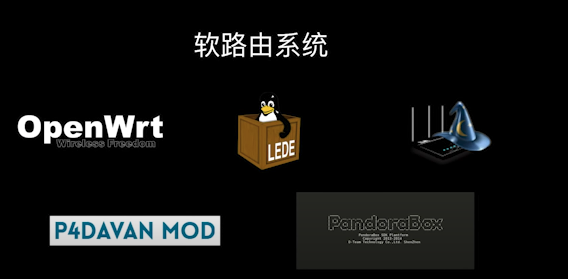
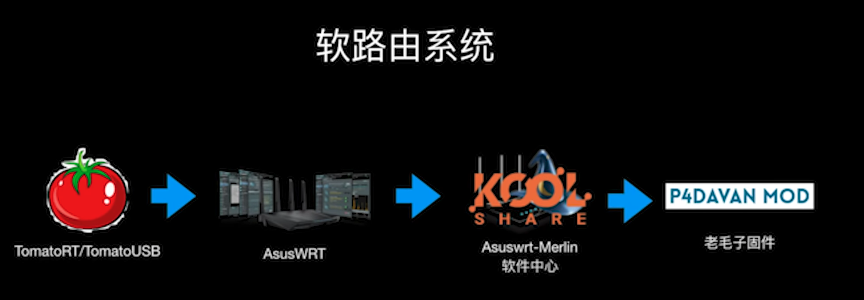
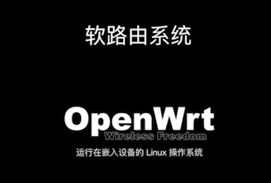

# 软路由




华硕路由器的官方固件 AsusWRT

是基于 TomatoRT 的固件改出来的

这些软件都支持GPL协议

国外网友基于华硕AsusRT开发了 Asuswrt-Merlin的固件【梅林】

增加了很多有用的功能，并且允许第三方开发者开发一些插件在上面运行

KOOL Share论坛的地方，里面大神开发了 **软件中心** 的插件，与梅林固件打包在一起供大家下载

但是因为梅林固件对硬件有一定的要求，不是一般的机器就可以刷的，战斗民族哥们在梅林基础上改了改开发出了P4DAVAN MOD【老毛子固件】，让很多低端配置的硬路由也吃上了梅林，也享受到了各种插件带来的好处。但是梅林依然不是想刷就能刷的。所以出现了OpenWrt



## OpenWrt

> 运行在嵌入设备的 Linux 操作系统
>
> 基于OpenWrt做出了很多操作系统
>
> - PandoraBox 【潘多拉】
> - LEDE

光有操作系统是没有用的，没有软件中心，依然是白瞎，所以KOOLSHARE论坛的大神又把软件中心移到了LEDE上

LEDE + 软件中心 = 软路由LEDE系统




```
echo 0xDEADBEEF > /etc/config/google_fu_mode
```


